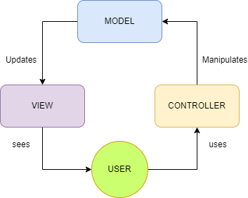

# Laporan Modul 1: Perkenalan Laravel
**Mata Kuliah:** Workshop Web Lanjut   
**Nama:** Ammar  
**NIM:** 2024573010129  
**Kelas:** TI2B  

---

## Abstrak 
Laporan ini menjelaskan tentang pengenalan pada laravel sebuah framework php, karakteristik utamanya, komponen-komponen utamanya, penjelasan folder dan filenya, cara kerja MVC pada laravel, dan kekurangan beserta kelebihannya.

---

## 1. Pendahuluan
>Apa itu Laravel?

Laravel adalah framework PHP yang populer, bersifat *open-source*, dan dirancang untuk membangun aplikasi web modern yang skalabel dan aman.
Laravel merupakan framework high-level yang bersifat opinionated (punya aturan dan konvensi tertentu). Nanti kita akan bahas lebih detail apa maksudnya. Laravel juga mengikuti arsitektur Model-View-Controller (MVC), yang akan kita pelajari lebih lanjut, dengan tujuan mempermudah sekaligus membuat proses pengembangan menjadi lebih efisien dan menyenangkan.

Bagi yang belum familiar, framework web adalah kumpulan pustaka (library) dan alat (tools) yang membantu pengembang membangun aplikasi lebih
cepat dengan menyediakan fitur-fitur umum seperti:
- Routing
- Manajemen basis data
- Autentikasi (authentication)

Laravel dibuat oleh Taylor Otwell pada tahun 2011 dan hingga kini menjadi salah satu framework PHP paling populer di dunia. Laravel dikenal karena:
- Sintaks yang ekspresif dan elegan
- Fitur yang lengkap dan kuat
- Komunitas yang aktif
- Laravel digunakan oleh pengembang di seluruh dunia untuk membangun berbagai jenis aplikasi, mulai dari blog sederhana hingga sistem perusahaan yang kompleks.

>Karakteristik utama
1. Framework High-level & Opinionated
   Laravel punya aturan & konvensi tertentu (best practices bawaan), sehingga kode lebih konsisten dan kolaborasi tim lebih gampang.

2. Menggunakan Arsitektur MVC (Model-View-Controller)
   Memisahkan logika bisnis, tampilan, dan alur kontrol → bikin aplikasi lebih rapi, terstruktur, dan mudah dipelihara.

3. Sintaks Ekspresif dan Elegan
   Kode Laravel didesain supaya mudah dibaca dan ditulis, membuat development lebih menyenangkan.

4. Keamanan Built-in
   Proteksi terhadap SQL Injection, CSRF, XSS sudah bawaan.

5. Skalabilitas
   Cocok dipakai untuk proyek kecil sampai aplikasi enterprise.

6. Komunitas Besar & Dukungan Pustaka
   Ada banyak paket tambahan, dokumentasi, dan komunitas aktif.

>Untuk jenis aplikasi apa Laravel cocok?
  Laravel adalah framework backend yang menyediakan berbagai fitur lengkap untuk membangun aplikasi web modern, seperti routing, validasi, caching, antrian, penyimpanan file, dan lainnya. 

  Laravel sangat cocok digunakan untuk berbagai jenis aplikasi, mulai dari website sederhana, blog, sistem manajemen konten (CMS), aplikasi e-commerce, hingga aplikasi perusahaan berskala besar. Selain itu, Laravel juga mendukung pengembangan full-stack dengan pendekatan yang memudahkan integrasi antara backend dan frontend.

---

## 2. Komponen Utama Laravel
1. Blade (templating)
   Blade adalah templating engine bawaan Laravel untuk merender view. Kita dapat mengirim data dari basis data atau sumber lain ke dalam view. Sekarang Blade juga memiliki sistem component, sehingga kita bisa membangun UI seperti menggunakan frontend framework (misalnya React).

2. Eloquent (ORM)
   Eloquent adalah ORM bawaan Laravel untuk berinteraksi dengan basis data. Dengan Eloquent, kita tidak perlu menulis query SQL mentah. Sintaksnya sangat elegan untuk melakukan operasi seperti mengambil, membuat, memperbarui, dan menghapus data.

3. Routing
   Sistem routing Laravel sangat dinamis dan mudah digunakan. Mendukung URL pattern, middleware, route grouping, serta resource route.

4. Model
   Komponen Model bertanggung jawab untuk berinteraksi dengan basis data. Di Laravel, Eloquent ORM digunakan untuk mengelola operasi basis data. Model berisi logika bisnis dan aturan validasi data.

5. View
   Komponen View bertanggung jawab untuk menampilkan data kepada pengguna. View menerima data dari Controller dan merendernya menjadi tampilan yang dapat dilihat oleh pengguna. Laravel menggunakan Blade sebagai mesin templating untuk membuat Views yang dinamis dan mudah dikelola.

6. Controllers
   Komponen Controller bertindak sebagai perantara antara Model dan View. Controller menerima input dari pengguna, memprosesnya (dengan bantuan Model jika diperlukan), dan menentukan View yang sesuai untuk ditampilkan. Controller juga mengelola logika aplikasi yang tidak terkait langsung dengan Model atau View.

7. Migrations & Seeders
   Laravel menyediakan sistem migrasi dan seeder yang kuat untuk mengelola skema basis data. Pengembang dapat dengan mudah membuat, mengubah, dan menghapus tabel serta mengisi tabel dengan data dummy untuk pengujian.

8. Artisan CLI
   Command-line tool untuk mengelola aplikasi Laravel. Dengan Artisan, kita bisa menjalankan migrasi basis data, membuat controller dan model, menjalankan development server, dan banyak lagi.

9. Testing (PHPUnit)  
   Laravel sudah mendukung pengujian aplikasi secara langsung. Secara default, Laravel menyediakan integrasi dengan PHPUnit dan Pest, serta sudah menyertakan file konfigurasi `phpunit.xml` di dalam project. Framework ini juga menyediakan berbagai helper method yang memudahkan penulisan dan pengujian fitur aplikasi secara ekspresif dan efisien.

---

## 3. Folder dan File di laravel
<Folder
Berikut adalah folder-folder yang tersedia secara default:

  `App`
  Folder app berisi kode-kode inti dari aplikasi seperti Model, Controller, Commands, Listener, Events, dll. Poinnya, hampir semua class dari aplikasi berada di folder ini.

  `Bootstrap`
  Folder bootstrap berisi file app.php yang dimana akan dipakai oleh Laravel untuk boot setiap kali dijalankan.

  `Config`
  Folder config seperti namanya, berisi semua file konfigurasi aplikasi Anda.

  `Database`
  Folder database berisi database migrations, model factories, dan seeds. Folder ini akan bertanggung jawab dengan pembuatan dan pengisian tabel-tabel database.

  `Public`
  Folder public memiliki file index.php yaitu entry point dari semua requests yang masuk/diterima ke aplikasi. Folder ini juga tempat menampung gambar, Javascript, dan CSS.

  `Resources`
  Folder resources berisi semua route yang disediakan aplikasi. Sebagai default, beberapa file routing akan tersedia seperti: web.php, api.php, console.php, dan channels.php. Folder ini adalah tempat dimana kita memberikan koleksi definisi route aplikasi.
 
  `Storage`
  Folder storage adalah tempat dimana cache, logs, dan file sistem yang ter-compile hidup.

  `Tests`
  Folder tests adalah tempat dimana unit dan integration tests tinggal.

  `Vendor`
  Folder vendor adalah dimana tempat folder-folder dependencies third-party yang telah di-install oleh composer berada.

<Files
Berikut adalah file-file yang tersedia secara default:

  `.editorconfig`
  Berguna untuk memberi IDE/text editor instruksi tentang standar coding Laravel seperti whitespace, besar identasi, dll.

  `.env dan .env.example`
  Tempat dimana variable environment aplikasi ditempatkan (variabel yang diekspektasikan akan berbeda di setiap sistem) seperti nama database, username database, password database. 

 `.gitignore dan .gitattributes`
  File konfigurasi git.

  `artisan`
  Memungkinkan anda untuk menjalankan perintah artisan dari command line.

  `composer.json dan composer.lock`
  File konfigurasi untuk composer. File ini adalah informasi dasar tentang projek dan juga mendefinisikan dependencies yang digunakan.

  `package.json`
  Mirip-mirip dengan composer.json tapi untuk aset-aset dan dependencies front-end.

  `phpunit.xml`
  Sebuah file konfigurasi untuk PHPUnit, tools yang digunakan Laravel untuk testing.

  `readme.md`
  Sebuah markdown file yang memberikan pengenalan dasar tentang Laravel.

  `vite.config.js`
  vite.config.js adalah file konfigurasi Vite.
  Sejak Laravel 9.19, Laravel pakai Vite (menggantikan Laravel Mix) sebagai build tool untuk mengelola aset frontend (CSS, JS, Vue/React, dll).

---

## 4. Diagram MVC dan Cara kerjanya

>Cara Kerja MCV

MVC memiliki cara kerja yang terpisah dan terstruktur, yaitu dengan memanfaatkan Model, View dan Controller. Masing-masing alur tersebut memiliki tugas yang telah kami bahas pada bagian apa itu MVC. Berikut kami berikan gambaran sederhana dari cara kerja MVC.

Dimulai dari Model yang berfungsi menentukan alur logika dari program yang akan dibuat dan dikembangkan. Model memastikan program dapat bertukar data dengan database melalui aksi CRUD, kemudian menampilkan hasilnya dalam View. View berperan sebagai output yang menggambarkan detail atau hasil dari permintaan yang dibuat oleh pengguna.

Controller memastikan bahwa permintaan pengguna yang ingin ditampilkan pada View dapat diteruskan ke Model. Selanjutnya, respon dari Model dikembalikan ke Controller dan diteruskan ke View sesuai dengan peran yang telah dirancang.

---

## 6. Kelebihan & Kekurangan (refleksi singkat)
>Kelebihan Laravel
- Sangat mudah dipelajari untuk pemula.
- Proses developing menjadi lebih praktis.
- Laravel ini sudah digunakan di seluruh dunia, jadi memungkinkan bagi pemula untuk beradaptasi dengan lebih mudah dalam projects baru.
- Tools yang ada cocok untuk advance dan developer pemula.
- Forum dan dokumentasi yang banyak, sehingga kamu dapat berdiskusi jika terjadi kendala atau error.
- Memiliki dasar template yang cukup ringan.
- Kode yang dimiliki cukup rapi dibandingkan.
- Memiliki banyak Fitur yang tersedia.

>Kekurangan Laravel
- Perlu sering melakukan pembaruan kedalam versi baru, dalam waktu yang cepat juga, jika dibandingkan framework lainnya.
- Pada sedikit kasus, waktu eksekusi Laravel sedikit lebih lambat dibanding CI.
- Memiliki ukuran kode yang termasuk berat untuk suatu framework.

---

## 7. Referensi
- Modul 1 - introduction 
  https://hackmd.io/@mohdrzu/By0Wc1Dule#Pustaka-Libraries-di-Laravel

- Frontend - introduction
  https://laravel.com/docs/12.x/frontend

- Kenalan dengan Laravel: Framework PHP yang Keren dan Serbaguna
  https://www.dicoding.com/blog/kenalan-dengan-laravel-framework-php-yang-keren-dan-serbaguna/

- Testing - Introduction
  https://laravel.com/docs/12.x/testing

- Mengenal Struktur Folder dan file pada laravel
  https://www.barajacoding.or.id/mengenal-struktur-folder-dan-file-pada-laravel/

- Markdown – Memasukkan Gambar
  https://www.ulas.in/komputer/markdown-memasukkan-gambar/

- Apa Itu MVC: Konsep, Kelebihan, Cara Kerja dan Contohnya
  https://www.rumahweb.com/journal/mvc-adalah/

---
