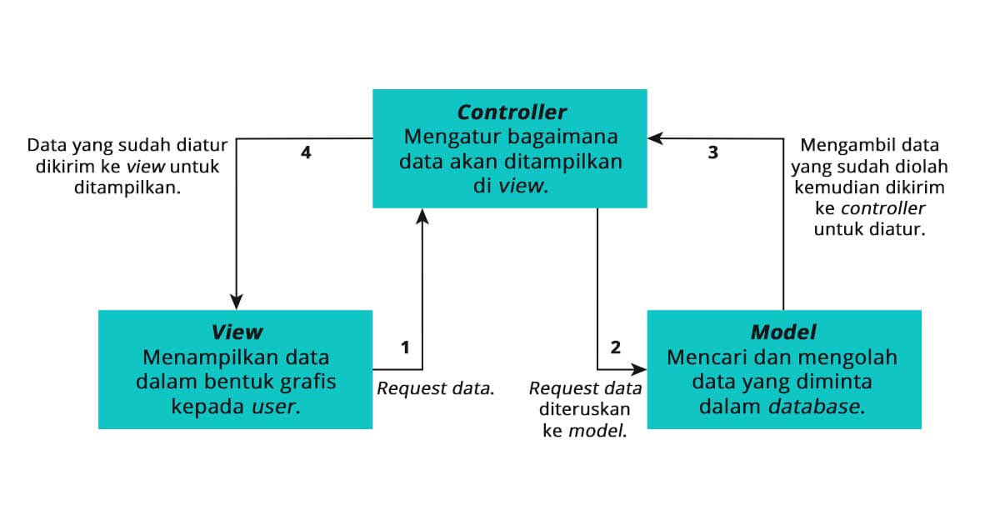
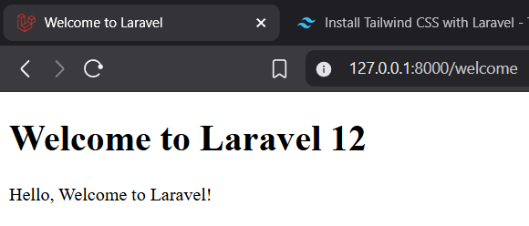
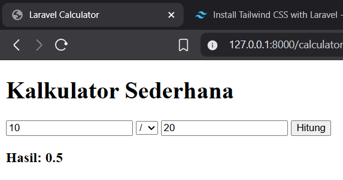
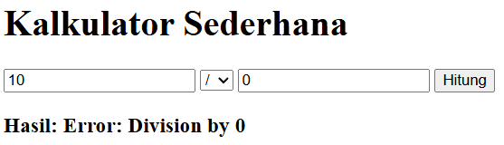

# Laporan Modul 2: Laravel Fundamental
**Mata Kuliah:** Workshop Web Lanjut   
**Nama:** Ammar  
**NIM:** 2024573010129  
**Kelas:** TI2B  

---

## Abstrak 
Laporan Praktikum ini mempelajari penerapan `MVC`, Routing, Request/Respond handling, dan Blade template engine yang digunakan dalam pembuatan aplikasi kalkulator sederhana. Teori yang digunakan adalah pemisahan logika dan validasi input. Melalui praktikum, aplikasi ini berhasil menghitung operasi dasar dan menangani error pembagian dengan nol. hasil praktikum menunjukkan peran penting validasi dan struktur `MVC` dalam menjaga keandalan aplikasi.

---

## 1. Dasar Teori
### MVC
`MVC` (Model, View, Controller) adalah sebuah pola arsitektur dalam membuat sebuah aplikasi dengan cara memisahkan kode menjadi tiga bagian yang terdiri dari:
- `Model` Merepresentasikan data dan logika bisnis. Dalam Laravel, biasanya ditangani oleh Eloquent models yang berinteraksi dengan database.
- `View` Menangani lapisan presentasi — yaitu HTML yang ditampilkan kepada pengguna. Laravel menggunakan Blade sebagai template engine untuk view.
- `Controller` Mengatur alur antara model dan view. Controller menerima input dari pengguna (melalui route), memprosesnya (seringkali melibatkan model), dan mengembalikan view atau respons yang sesuai.
Laravel sepenuhnya mengadopsi pola MVC, sehingga menjadikannya pilihan yang andal untuk pengembangan web modern dan terstruktur.
>Berikut ini adalah alur prosesnya.
- Proses pertama adalah view akan meminta data untuk ditampilkan dalam bentuk grafis kepada pengguna.
- Permintaan tersebut diterima oleh controller dan diteruskan ke model untuk diproses.
- Model akan mencari dan mengolah data yang diminta di dalam database
- Setelah data ditemukan dan diolah, model akan mengirimkan data tersebut kepada controller untuk ditampilkan di view.
- Controller akan mengambil data hasil pengolahan model dan mengaturnya di bagian view untuk ditampilkan kepada pengguna.

>Manfaat MVC
- `Proses pengembangan aplikasi menjadi lebih efisien`
  Penggunaan MVC dapat mempercepat pengembangan aplikasi karena kode dapat dikerjakan oleh beberapa developer. Contohnya dalam kasus pengembangan aplikasi web, bagian model dan controller dapat dikerjakan oleh back-end developer sedangkan bagian view dapat dilakukan oleh front-end developer.

- `Penulisan kode menjadi lebih rapi`
  Karena dibagi menjadi tiga bagian, maka penulisan kode akan jadi lebih rapi dan memudahkan developer lain untuk mengembangkan kode tersebut.

- `Dapat melakukan testing dengan lebih mudah`
  Untuk memastikan seluruh aplikasi bekerja sesuai dengan rencana maka langkah testing atau uji coba wajib dilakukan. Dengan menggunakan model view controller ini, maka proses uji coba dapat dilakukan pada setiap bagian.

- `Perbaikan bug atau error lebih cepat untuk diselesaikan`
  Penggunaan MVC dapat memudahkan developer untuk memperbaiki error atau bug yang terjadi. Developer dapat fokus untuk menemukan dan memperbaiki masalah yang terjadi karena kode dituliskan pada bagian-bagian terpisah.

- `Mempermudah pemeliharaan`
  Konsep MVC ini dapat mempermudah pemeliharaan aplikasi, karena script atau kode yang lebih rapi dan terstruktur sehingga mempermudah developer dalam proses pemeliharaan aplikasi.

### Routing
`Routing` di Laravel mendefinisikan bagaimana aplikasi merespons permintaan (request) yang masuk. Routing memetakan URI ke aksi controller atau closure. Route di Laravel didefinisikan di file routes/web.php untuk permintaan web dan di routes/api.php untuk route API.

>Berikut Contoh Route 

- Sederhana dengan kembalian string:

      Route::get('/Test', function () {
          return 'Hello World';
      });

- Route dengan parameter:

      Route::get('/user/{id}', function($id) {
        return "User id: " . $id;
      });

- Named Routes, memudahkan membuat URL atau melakukan redirect:

      Route:gate('/welcome', [WelcomeController::class, 'hello']);

### Middleware
Middleware menyediakan mekanisme untuk memfilter permintaan HTTP yang masuk ke aplikasi Anda. Middleware bertindak sebagai lapisan yang berada di antara siklus request dan response.

>Fungsi Middleware

- Authentication (auth)
- Logging
- CORS
- Input sanitization

>Menambahkan Middleware ke Route

1. Berikut contoh cara menambahkan middleware pada sebuah route:

        Route::get('/dashboard', function () {
            return view('dashboard');
        })->middleware('auth');

2. Membuat middleware kustom menggunakan perintah Artisan:

        php artisan make:middleware CheckAge

3. Lalu edit file di:

        app/Http/Middleware/EnsureUserIsAdmin.php

4. dan daftarkan di:

        app/Http/Kernel.php

### Request dan Response Handle di laravel
Laravel mempermudah dalam menangani HTTP request dan menghasilkan response.
>Mengakses Data Request

Kita dapat mengakses data request menggunakan objek Request:

    use Illuminate\Http\Request;
    use Illuminate\Support\Facades\Route;

    Route::get('/user', function (Request $request) {
        $name = $request->input('name');
        return "Hello, " . $name;
    });

Kita juga dapat dengan mudah mengakses parameter query, data form, dan payload JSON.

Dalam controller atau route closure:

    $request->input('name');
    $request->query('page'); // untuk query string ?page=1

Atau menggunakan helper:

    $name = request('name');

>Form Request

Laravel memungkinkan kita untuk memvalidasi dan mengotorisasi data request yang masuk melalui class form request:

    php artisan make:request StoreUserRequest

>Return Response

Laravel menyediakan cara sederhana untuk mengembalikan response. Kita dapat mengembalikan string, view, JSON, atau bahkan file download.

    return response('Hello World', 200)
        ->header('Content-Type', 'text/plain');

Laravel juga mendukung response dalam bentuk JSON, redirect, file download, dan lainnya.

### Controller and View Role

Controller digunakan untuk mengatur logika aplikasi Anda. File controller berada di dalam `app/Http/Controllers.`

1. Cara membuat Controller menggunakan perintah artisan:

        php artisan make:controller HomeController

2. Mendefinisikan sebuah method di dalam Controller yang telah dibuat untuk menangani route tertentu:

        public function welcome() {
          return view('welcome');
        }

3. Menambahkan Route di file routes/web agar terhubung dengan controller:

        Route:gate('/welcome', [WelcomeController::class, 'welcome']);

4. Membuat file view di resources/views:

        <!DOCTYPE html>
        <html>
        <head>
            <title>Welcome</title>
        </head>
        <body>
            <h1>Selamat Datang di Laravel 17!</h1>
        </body>
        </html>

### Blade Templating Engine
Blade merupakan template engine yang disediakan oleh laravel.
Fungsi:

    <h1>
        Hello, {{$name}}
    </h1>

  
---

## 2. Langkah-Langkah Praktikum
Tuliskan langkah-langkah yang sudah dilakukan, sertakan potongan kode dan screenshot hasil.

### 2.1 Praktikum 1 – Route, Controller, dan Blade View
>Berikut Langkah-langkahnya:

1. Tambahkan route pada routes/web.php.

        <?php

        use Illuminate\Support\Facades\Route;
        use App\Http\Controllers\WelcomeController;

        Route::get('/', function () {
            return view('welcome');
        });

        Route::get('/welcome', [WelcomeController::class, 'show']);

2. Buat controller WelcomeController.

   Buat file WelcomeController dengan perintah artisan: 

        php artisan make:controller WelcomeController

   Masuk ke file `app/Http/Controllers/WelcomeController` dan masukkan code berikut:

        <?php

        namespace App\Http\Controllers;

        class WelcomeController extends Controller
        {
            public function show() {
                $message = "Welcome to Laravel!";
                return view('mywelcome', ['message' => $message]);
            }
        }

3. Buat view mywelcome.blade.php.

   Buat file `mywelcome.blade.php` di `resources\views` lalu masukkan kode berikut:

        <!DOCTYPE html>
        <html>
            <head>
                <title>Welcome to Laravel</title>
            </head>
            <body>
                <h1>
                    Welcome to Laravel 12
                </h1>
                

                    Hello, {{ $message }}
                

            </body>
        </html>

4. Jalankan aplikasi dan tunjukkan hasil di browser.

   Untuk menjalankan aplikasi kita bisa menggunakan perintah artisan berikut:

        php artisan serve

   lalu ctrl+klik `http://127.0.0.1:8000` sehingga akan diredirect ke web browser.
   
   pada URL masukkan /welcome agar masuk ke halaman web yang telah kita buat.

>Screenshot Hasil:

### 2.2 Praktikum 2 – Membuat Aplikasi Sederhana "Calculator"
>Berikut Langkah-langkahnya:

1. Tambahkan route untuk kalkulator.

        <?php

        use Illuminate\Support\Facades\Route;
        use App\Http\Controllers\CalculatorController;

        Route::get('/', function () {
            return view('welcome');
        });

        Route::get('/calculator', [CalculatorController::class, 'index']);
        Route::post('/calculator', [CalculatorController::class, 'calculate']) ->name('calculator.calculate');

2. Buat controller CalculatorController.

   Buat file WelcomeController dengan perintah artisan: 

        php artisan make:controller CalculatorController

   Masuk ke file `app/Http/Controllers/CalculatorController` dan masukkan code berikut:

        <?php

        namespace App\Http\Controllers;
        use Illuminate\Http\Request;

        class CalculatorController extends Controller {
            public function index() {
                return view('calculator');
            }

            public function calculate(Request $request) {
                $validated = $request->validate([
                    'number1' => 'required|numeric',
                    'number2' => 'required|numeric',
                    'operator' => 'required|in:add,sub,mul,div',
                ]);

                $result = match ($validated['operator']) {
                    'add' => $validated['number1'] + $validated['number2'],
                    'sub' => $validated['number1'] - $validated['number2'],
                    'mul' => $validated['number1'] * $validated['number2'],
                    'div' => $validated['number2'] != 0 ? ($validated['number1'] / $validated['number2']) : 'Error: Division by 0',
                };

                return view('calculator', [
                    'result' => $result,
                    'number1' => $validated['number1'],
                    'number2' => $validated['number2'],
                    'operation' => $validated['operator'],
                ]);
            }
        }

3. Tambahkan view calculator.blade.php.

   Buat file `calculator.blade.php` di `resources\views` lalu masukkan kode berikut:

        <!DOCTYPE html>
        <html>
            <head>
                <title>Laravel Calculator</title>
            </head>
            <body>
                <h1>Kalkulator Sederhana</h1>

                @if ($errors->any())
                    

                        <ul>
                            @foreach ($errors->all() as $error)
                                <li>{{ $error }}</li>
                            @endforeach
                        </ul>
                    

                @endif

                <form method="POST" action="{{ route('calculator.calculate') }}">
                    @csrf
                    <input type="number" id="number1" name="number1" value="{{ old('number1', $number1 ?? '') }}" placeholder="Angka Pertama" required>

                    <select id="operator" name="operator" required>
                        <option value="add" {{ ($operator ?? '') == 'add' ? 'selected' : '' }}>+</option>
                        <option value="sub" {{ ($operator ?? '') == 'sub' ? 'selected' : '' }}>-</option>
                        <option value="mul" {{ ($operator ?? '') == 'mul' ? 'selected' : '' }}>*</option>
                        <option value="div" {{ ($operator ?? '') == 'div' ? 'selected' : '' }}>/</option>
                    </select>

                    <input type="number" id="number2" name="number2" value="{{ old('number2', $number2 ?? '') }}" placeholder="Angka Kedua" required>
                    <button type="submit">Hitung</button>
                </form>     

                

                @isset($result)
                    <h3>Hasil: {{ $result }}</h3>
                @endisset
            </body>
        </html>

4. Jalankan aplikasi dan coba dengan beberapa input berbeda.

   Untuk menjalankan aplikasi kita bisa menggunakan perintah artisan berikut:

        php artisan serve

   lalu ctrl+klik `http://127.0.0.1:8000` sehingga akan diredirect ke web browser.
   
   pada URL masukkan /calculator agar masuk ke halaman web yang telah kita buat.

>Screenshot Hasil:

---

## 3. Hasil dan Pembahasan
Jelaskan apa hasil dari praktikum yang dilakukan.
- Apakah aplikasi berjalan sesuai harapan?

  Ya, kedua aplikasi berjalan sesuai harapan.

- Apa yang terjadi jika ada input yang salah (misalnya pembagian dengan 0)?

  Dikarenakan error sudah diantisipasi di controller maka aplikasi tidak crash dan menghasilkan berikut di halaman web:

  

- Bagaimana validasi input bekerja di Laravel?

  Validasi input di laravel bekerja dengan melalui `$request->validate()` pada controller maka jika user tidak menginput bukan number, maka laravel akan mengembalikan error.

- Apa peran masing-masing komponen (Route, Controller, View) dalam program yang dibuat?

  - Route: Berperan sebagai penghubung alamat ke fungsi controller.
  - Controller: Berperan dengan mengolah input, melakukan validasi, dan menghitung hasilnya juga mengembalikan nilai.
  - View: Berperan sebagai halaman yang akan ditampilkan di browser seperti form, dan hasil kembalian.

---

## 4. Kesimpulan
1. Aplikasi welcome dan kalkulator berjalan sesuai harapan dengan pengembalian nilai, dan operasi aritmatika pada aplikasi kalkulator.
2. Memberi logika validasi pada inputan angka, dan juga memberi validasi pembagian 0.
3. Pemisahan komponen Route, Controller, dan view yang membantu menjaga struktur program lebih rapi Sesuai Teori *MVC*.

---

## 5. Referensi
- Apa Itu MVC? Pahami Konsepnya dengan Baik - https://www.dicoding.com/blog/apa-itu-mvc-pahami-konsepnya/
- Modul 2 - Laravel Fundamentals - https://hackmd.io/@mohdrzu/B1zwKEK5xe

---
