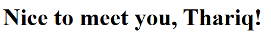
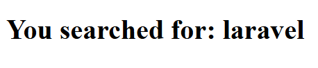
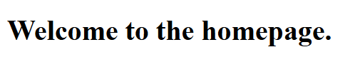
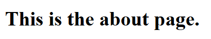
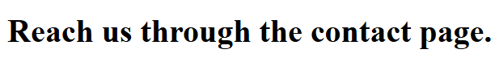
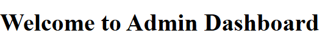
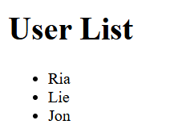
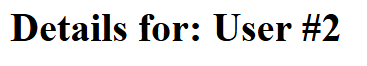

# Laporan Modul 3: Laravel Controller  
**Mata Kuliah:** Workshop Web Lanjut  
**Nama:** Ammar  
**NIM:** 2024573010129  
**Kelas:** TI2B  

---

## Abstrak
Laporan praktikum ini mempelajari konsep dan penerapan **Controller** dalam framework Laravel.  
Controller berperan penting sebagai penghubung antara `Model` dan `View`, menangani logika aplikasi, menerima input pengguna, dan mengembalikan respons yang sesuai.  
Praktikum ini mencakup pembuatan controller dasar, penerusan data ke view, pengelompokan rute dengan controller, serta penggunaan `prefix` dan `namespace` untuk struktur aplikasi yang lebih terorganisir.  
Hasil praktikum menunjukkan bahwa penggunaan controller mempermudah pengelolaan logika aplikasi, meningkatkan keterbacaan kode, dan memperkuat penerapan pola `MVC` di Laravel.

---

## 1. Dasar Teori

### Apa Itu Controller?
Dalam pola **MVC (Model-View-Controller)**, controller bertindak sebagai jembatan antara model dan view.  
Controller menerima permintaan dari pengguna melalui *route*, memproses data (biasanya dengan bantuan model), dan kemudian mengembalikan respons — baik berupa tampilan (*view*), data JSON, maupun pengalihan (*redirect*).

### Contoh pembuatan controller:

    php artisan make:controller PageController

Perintah ini akan membuat file:

    app/Http/Controllers/PageController.php

Contoh isi controller sederhana:

    namespace App\Http\Controllers;
    use Illuminate\Http\Request;

    class PageController extends Controller
    {
        public function home()
        {
            return view('home');
        }
    }

Untuk menggunakan controller, daftarkan di routes/web.php:

    use App\Http\Controllers\PageController;
    Route::get('/home', [PageController::class, 'home']);

### Jenis-Jenis Controller di Laravel

Laravel mendukung beberapa jenis controller untuk berbagai kebutuhan pengembangan:

1. Basic Controller

   Kelas standar dengan banyak metode untuk menangani berbagai endpoint.

2. Resource Controller

   Digunakan untuk operasi CRUD dengan konvensi RESTful.

        php artisan make:controller ProductController --resource

   Metode otomatis yang dibuat antara lain:

   index(), create(), store(), show(), edit(), update(), destroy()

3. Invokable Controller

   Cocok untuk controller dengan satu aksi saja.

        php artisan make:controller ContactController --invokable

    Didaftarkan di route seperti ini:

        Route::get('/contact', ContactController::class);

### Pengelompokan Rute dengan Controller

Laravel memungkinkan pengelompokan beberapa rute agar kode lebih rapi:

    Route::controller(UserController::class)->group(function () {
        Route::get('/users', 'index');
        Route::get('/users/{id}', 'show');
    });

Dengan ini, semua rute yang menggunakan UserController akan lebih mudah dikelola tanpa pengulangan.

### Injeksi Request dan Dependensi

Laravel mendukung dependency injection pada metode controller.

Contoh menyuntikkan Request:

    use Illuminate\Http\Request;

    public function store(Request $request)
    {
        $data = $request->all();
    }

Contoh menyuntikkan layanan lain:

    public function index(UserService $service)
    {
        return $service->getAllUsers();
    }

### Validasi pada Controller

Validasi input dapat dilakukan langsung di metode controller:

    public function store(Request $request)
    {
        $request->validate([
            'name' => 'required|string|max:255',
            'email' => 'required|email|unique:users'
        ]);
    }

Atau dengan menggunakan Form Request (lebih bersih):

    php artisan make:request StoreUserRequest

Lalu di controller:

    public function store(StoreUserRequest $request)
    {
        $validated = $request->validated();
    }

### Mengembalikan Respons dari Controller

Controller dapat mengembalikan berbagai jenis respons:

- View

        return view('welcome');

- JSON

        return response()->json(['status' => 'success']);

- Redirect

        return redirect()->route('home');

- Custom Response

        return response('Hello', 200)->header('Content-Type', 'text/plain');

---

# 2. Langkah-Langkah Praktikum
### 2.1 Praktikum 1 – Menangani Request dan Response View

Tujuan: Meneruskan data dari controller ke view dan menangani parameter dari route.

>Langkah-langkah:

1. Buat project lab-view

        composer create-project laravel/laravel:^12.0.3 lab-view
        cd lab-view

2. Buat controller DemoController:

        php artisan make:controller DemoController

3. Tambahkan metode:

        public function hello() 
        {
            $name = 'Laravel Learner';
            return view('hello', ['name' => $name]);
        }

        public function greet($name) 
        {
            return view('greet', ['name' => ucfirst($name)]);
        }

        public function search(Request $request) 
        {
            $keyword = $request->query('q', 'none');
            return view('search', ['keyword' => $keyword]);
        }

4. Definisikan route:

        use App\Http\Controllers\DemoController;

        Route::get('/hello', [DemoController::class, 'hello']);
        Route::get('/greet/{name}', [DemoController::class, 'greet']);
        Route::get('/search', [DemoController::class, 'search']);

5. Buat view:

    `resources/views/hello.blade.php`

        <!DOCTYPE html>
        <html lang="en">
        <head>
            <title>Hello</title>
        </head>
        <body>
            <h1>Hello, {{ $name }}!</h1>
        </body>
        </html>

    `resources/views/greet.blade.php`

        <!DOCTYPE html>
        <html lang="en">
        <head>
            <title>Greet</title>
        </head>
        <body>
            <h1>Nice to meet you, {{ $name }}!</h1>
        </body>
        </html>

    `resources/views/search.blade.php`

        <!DOCTYPE html>
        <html lang="en">
        <head>
            <title>Search</title>
        </head>
        <body>
            <h1>You searched for: <strong>{{ $keyword }}</strong></h1> 
        </body>
        </html>

>Screenshot Hasil:

- `/hello`

    

- `/greet/Thariq`

    

- `/search?q=laravel` 

    

### 2.2 Praktikum 2 – Menggunakan Group Route

Tujuan: Mengelompokkan beberapa rute ke dalam satu controller.

>Langkah-langkah:

1. Buat project lab-group

        composer create-project laravel/laravel:^12.0.3 lab-group
        cd lab-group

2. Buat controller:

        php artisan make:controller PageController

3. Tambahkan kode pada PageController:

        public function home() 
        {
            $message = "Welcome to the homepage.";
            return view('pages.home', compact('message'));
        }

        public function about() 
        {
            $message = "This is the about page.";
            return view('pages.about', compact('message'));
        }

        public function contact() 
        {
            $message = "Reach us through the contact page.";
            return view('pages.contact', compact('message'));
        }

4. Definisikan rute:

        Route::controller(PageController::class)->group(function (){
            Route::get('/', 'home')->name('home');
            Route::get('/about', 'about')->name('about');
            Route::get('/contact', 'contact')->name('contact'); 
        });

5. Buat view:

    `resources/views/pages/about.blade.php`

        <!DOCTYPE html>
        <html lang="en">
        <head>
            <title>About</title>
        </head>
        <body>
            <h1>{{ $message }}</h1> 
        </body>
        </html>

    `resources/views/pages/contact.blade.php`

        <!DOCTYPE html>
        <html lang="en">
        <head>
            <title>Contact</title>
        </head>
        <body>
            <h1>{{ $message }}</h1> 
        </body>
        </html>

    `resources/views/pages/home.blade.php`

        <!DOCTYPE html>
        <html lang="en">
        <head>
            <title>Home</title>
        </head>
        <body>
            <h1>{{ $message }}</h1> 
        </body>
        </html>

>Screenshot Hasil:

- `/` **home** page

    

- `/about` page

    

- `/contact` page

    

### 2.3 Praktikum 3 – Prefix dan Namespace Route

Tujuan: Mengelompokkan rute dalam folder Admin menggunakan prefix URL.

>Langkah-langkah:

1. Buat project lab-prefix

        composer create-project laravel/laravel:^12.0.3 lab-prefix
        cd lab-prefix

2. Buat controller di namespace Admin:

        php artisan make:controller Admin/DashboardController
        php artisan make:controller Admin/UserController

3. Tambahkan kode pada Admin/DashboardController:

        public function index() 
        {
            return view('admin.dashboard', ['message' => 'Welcome to Admin Dashboard']);
        }

4. Tambahkan kode pada Admin/UserController:

        public function index() 
        {
            $users = ['Ria', 'Lie', 'Jon'];
            return view('admin.users.index', compact('users'));
        }

        public function show($id) 
        {
            $user = "User #" . $id;
            return view('admin.users.show', compact('user'));
        }

5. Definisikan route:

        use App\Http\Controllers\Admin\DashboardController;
        use App\Http\Controllers\Admin\UserController;

        Route::prefix('admin')->group(function () {
            Route::get('/dashboard', [DashboardController::class, 'index'])->name('admin.dashboard');
            Route::get('/users', [UserController::class, 'index'])->name('admin.users');
            Route::get('/users/{id}', [UserController::class, 'show'])->name('admin.users.show');
        });

6. Buat view:

    `resources/views/admin/users/index.blade.php`

        <!DOCTYPE html>
        <html lang="en">
        <head>
            <title>Users</title>
        </head>
        <body>
            <h1>User List</h1>
            <ul>
                @foreach ($users as $user)
                    <li>{{ $user }}</li> 
                @endforeach
            </ul>  
        </body>
        </html>

    `resources/views/admin/users/show.blade.php`

        <!DOCTYPE html>
        <html lang="en">
        <head>
            <title>User Details</title>
        </head>
        <body>
            <h1>Details for: {{ $user }}</h1> 
        </body>
        </html>

    `resources/views/admin/dashboard.blade.php`

        <!DOCTYPE html>
        <html lang="en">
        <head>
            <title>Admin Dashboard</title>
        </head>
        <body>
            <h1>{{ $message }}</h1> 
        </body>
        </html>

>Screenshot Hasil:

- `/admin/dashboard` 

    

- `/admin/users` 

    

- `/admin/users/2`

    

---

## 3. Hasil dan Pembahasan

- Controller berhasil digunakan untuk menangani logika    aplikasi dan memisahkan kode dari view.

- Data dapat diteruskan dari controller ke view menggunakan fungsi compact() atau array asosiatif.

- Group route dan prefix membantu menjaga struktur kode tetap rapi dan mudah dikelola.

- Namespace Admin memungkinkan pemisahan modul antara pengguna biasa dan admin.

---

## 4. Kesimpulan

1. Controller di Laravel berfungsi sebagai pengatur logika aplikasi dan penghubung antara route, model, dan view.

2. Penggunaan group route dan prefix meningkatkan keteraturan serta skalabilitas aplikasi.

3. Validasi input dan injeksi dependensi di controller membuat kode lebih aman dan efisien.

4. Dengan memahami dasar penggunaan controller, pengembangan aplikasi Laravel menjadi lebih terstruktur dan mudah dipelihara.

---

## 5. Referensi

- Laravel Documentation – Controllers - https://laravel.com/docs/12.x/controllers

- Modul 3 – Laravel Controller - https://hackmd.io/@mohdrzu/H1sB73dnxg