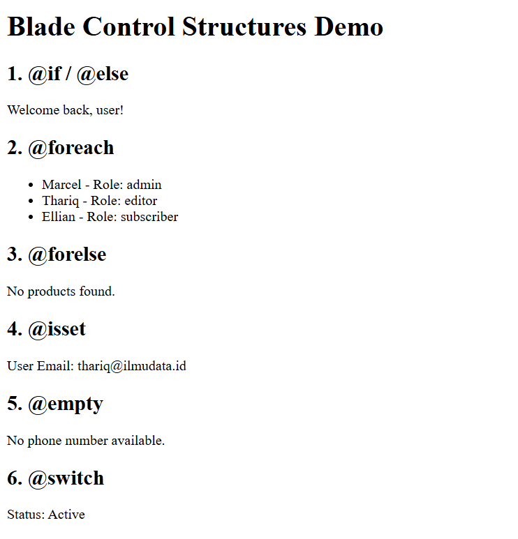
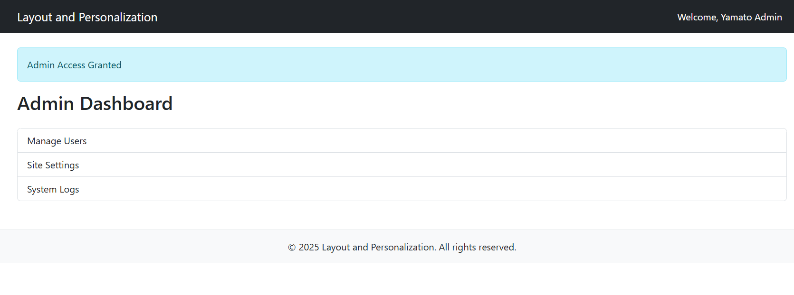

# Laporan Modul 4: Laravel Blade Template Engine
**Mata Kuliah:** Workshop Web Lanjut  
**Nama:** Ammar  
**NIM:** 2024573010129  
**Kelas:** TI2B  

---

## Abstrak
Laporan ini membahas penerapan *Blade Template Engine* dalam framework Laravel, yang merupakan sistem templating bawaan Laravel untuk mengelola tampilan (*view*). Blade memungkinkan pengembang menulis kode PHP dalam template dengan sintaks yang lebih ringkas, bersih, dan mudah dibaca.  
Melalui praktikum ini, dilakukan implementasi konsep dasar Blade, struktur kontrol, *layouts*, *components*, *partial views*, serta *theme switching* menggunakan *session*.  
Hasil akhir menunjukkan bahwa penggunaan Blade mempercepat proses pengembangan antarmuka web, menjaga konsistensi tampilan, dan mendukung penerapan prinsip *Don't Repeat Yourself (DRY)* dalam pengelolaan *view* Laravel.

---

## 1. Dasar Teori

### 1.1 Pengertian Blade
Blade adalah *template engine* bawaan Laravel yang menyediakan cara sederhana dan efisien untuk mengelola tampilan. Blade tidak membatasi penggunaan sintaks PHP dan mendukung fitur seperti *template inheritance*, *components*, dan *sections* untuk membuat tampilan yang dinamis dan modular.

Ciri khas Blade:
- Ringan dan cepat.
- Mendukung *layout inheritance* dan *components*.
- Menggunakan sintaks kontrol seperti `@if`, `@foreach`, `@include`, `@yield`, `@extends`, dan lainnya.

Contoh view sederhana:

    <h1>Hello, {{ $name }}</h1>
Data `$name` diteruskan dari controller menggunakan:

    return view('greeting', ['name' => 'Agus']);

### 1.2 Struktur Kontrol Blade
Blade menyediakan struktur logika layaknya PHP, tetapi dengan sintaks yang lebih bersih:

    @if ($user)
        Hello, {{ $user->name }}
    @else
        Welcome, Guest!
    @endif
Untuk perulangan:

    @foreach ($posts as $post)
        
{{ $post->title }}

    @endforeach

### 1.3 Layout dan Sections
Blade mendukung konsep layout inheritance untuk membuat tampilan yang konsisten.

Contoh layout (layouts/app.blade.php):

    <html>
    <head>
        <title>My App - @yield('title')</title>
    </head>
    <body>
        @yield('content')
    </body>
    </html>
Contoh child view:

    @extends('layouts.app')

    @section('title', 'Home Page')

    @section('content')
        <h1>Welcome to the Home Page</h1>
    @endsection

### 1.4 Blade Components dan Partial Views
Partial View: menggunakan `@include` untuk menyisipkan bagian tampilan berulang seperti navbar atau footer.

Component: digunakan untuk elemen UI kompleks yang dapat menerima props dan slot.

Contoh komponen sederhana:

    

        {{ $slot }}
    

Digunakan di view:

    <x-alert>Terjadi kesalahan!</x-alert>

---

## 2. Langkah-Langkah Praktikum

### 2.1 Praktikum 1 – Meneruskan Data dari Controller ke Blade View
>Langkah-langkah:

1. Buat Projek laravel pada terminal vscode

        laravel new modul-4-blade-view

    lalu masuk ke dalam folder projek tsb.

        cd modul-4-blade-view

2. Tambahkan route pada routes/web.php.

        use Illuminate\Support\Facades\Route;
        use App\Http\Controllers\DasarBladeController;

        Route::get('/dasar', [DasarBladeController::class, 'showData']);

3. Buat controller DasarBladeController.

   Buat file DasarBladeController dengan perintah artisan: 

        php artisan make:controller DasarBladeController

   Masuk ke file `app/Http/Controllers/DasarBladeController` dan isikan code berikut pada class DasarBladeController:

        public function showData()
        {
            $name = 'Devi';
            $fruits = ['Apple', 'Banana', 'Cherry'];
            $user = [
                'name' => 'Eva',
                'email' => 'eva@ilmudata.id',
                'is_active' => true,
            ];
            $product = (object) [
                'id' => 1,
                'name' => 'Laptop',
                'price' => 12000000
            ];

            return view('dasar', compact('name', 'fruits', 'user', 'product'));
        }

4. Buat view dasar.blade.php.

   Buat file `dasar.blade.php` di `resources\views` lalu masukkan kode berikut:

        <!DOCTYPE html>
        <html lang="en">
        <head>
            <title>Data Passing Demo</title>
        </head>
        <body>
            <h1>Passsing Data to Blade View</h1>
            
            <h2>String</h2>
            
Name: {{ $name }}

            
            <h2>Array</h2>
            <ul>
                @foreach ($fruits as $fruit)
                    <li>{{ $fruit }}</li>         
                @endforeach
            </ul>
            
            <!-- <h2>Array Asosiatif</h2>
            <ul>
                @foreach ($user as $key => $value)
                    <li>User {{ $key }} = {{ $value }}</li> 
                @endforeach
            </ul> -->

            <h2>Associative Array</h2>
            
Name: {{ $user['name'] }}

            
Email: {{ $user['email'] }}

            
Status: {{ $user['is_active'] ? 'Active' : 'Inactive' }}
 
            
            <h2>Object</h2>
            
ID: {{ $product->id }}

            
Product: {{ $product->name }}

            
Price: RP{{ number_format($product->price, 0, ',', '.') }}
   
        </body>
        </html>

5. Jalankan aplikasi dan tunjukkan hasil di browser.

   Untuk menjalankan aplikasi kita bisa menggunakan perintah artisan berikut:

        php artisan serve

   lalu ctrl+klik `http://127.0.0.1:8000` sehingga akan diredirect ke web browser.
   
   pada URL masukkan `/dasar` agar masuk ke halaman web yang telah kita buat.

>Screenshot Hasil:

### 2.2 Praktikum 2 – Menggunakan Struktur Kontrol Blade

1. Pada projek `modul-4-blade-view` tambahkan route pada routes/web.php.

        use App\Http\Controllers\LogicController;

        Route::get('/logic', [LogicController::class, 'show']);

2. Buat controller LogicController.

   Buat file LogicController dengan perintah artisan: 

        php artisan make:controller LogicController

   Masuk ke file `app/Http/Controllers/LogicController` dan isikan code berikut pada class LogicController:

        public function show()
        {
            $isLoggedIn = true;
            $users = [
                ['name' => 'Marcel', 'role' => 'admin'],
                ['name' => 'Thariq', 'role' => 'editor'],
                ['name' => 'Ellian', 'role' => 'subscriber'],
            ];
            $products = []; // Simulasi array kosong untuk @forelse
            $profile = [
                'name' => 'Thariq',
                'email' => 'thariq@ilmudata.id'
            ];
            $status = 'active';
            
            return view('logic', compact('isLoggedIn', 'users', 'products', 'profile', 'status'));
        }

3. Buat view logic.blade.php.

   Buat file `logic.blade.php` di `resources\views` lalu masukkan kode berikut:

        <!DOCTYPE html>
        <html>
        <head>
            <title>Blade Logic Demo</title>
        </head>
        <body>
            <h1>Blade Control Structures Demo</h1>
            
            <h2>1. @if / @else</h2>
            @if ($isLoggedIn)
                
Welcome back, user!

            @else
                
Please log in.

            @endif
            
            <h2>2. @foreach</h2>
            <ul>
                @foreach ($users as $user)
                    <li>{{ $user['name'] }} - Role: {{ $user['role'] }}</li>
                @endforeach
            </ul>
            
            <h2>3. @forelse</h2>
            @forelse ($products as $product)
                
{{ $product }}

            @empty
                
No products found.

            @endforelse
            
            <h2>4. @isset</h2>
            @isset($profile['email'])
                
User Email: {{ $profile['email'] }}

            @endisset
            
            <h2>5. @empty</h2>
            @empty($profile['phone'])
                
No phone number available.

            @endempty
            
            <h2>6. @switch</h2>
            @switch($status)
                @case('active')
                    
Status: Active

                    @break
                @case('inactive')
                    
Status: Inactive

                    @break
                @default
                    
Status: Unknown

            @endswitch
        </body>
        </html>

4. Jalankan aplikasi dan tunjukkan hasil di browser.

   Untuk menjalankan aplikasi kita bisa menggunakan perintah artisan berikut:

        php artisan serve

   lalu ctrl+klik `http://127.0.0.1:8000` sehingga akan diredirect ke web browser.
   
   pada URL masukkan `/logic` agar masuk ke halaman web yang telah kita buat.

>Screenshot Hasil:

### 2.3 Praktikum 3 – Layout dan Personalisasi dengan Bootstrap

>Langkah-langkah:

1. Pada projek `modul-4-blade-view` tambahkan route pada routes/web.php.

        use App\Http\Controllers\PageController;

        Route::get('/admin', [PageController::class, 'admin']);
        Route::get('/user', [PageController::class, 'user']);

2. Buat controller PageController.

   Buat file PageController dengan perintah artisan: 

        php artisan make:controller PageController

   Masuk ke file `app/Http/Controllers/PageController` dan isikan code berikut pada class PageController:

        public function admin() 
        {
            $role = 'admin';
            $username = 'Yamato Admin';
            return view('admin.dashboard', compact('role', 'username'));
        }

        public function user() 
        {
            $role = 'user';
            $username = 'Liu User';
            return view('user.dashboard', compact('role', 'username'));
        }
 
3. Buat layouts directory di `resources\views`
        mkdir resources/views/layouts

4. Buat file `app.blade.php` di `resources\views\layouts` lalu masukkan kode berikut:

        <!DOCTYPE html>
        <html>
        <head>
            <title>@yield('title') | Layout and Personalization</title>
            <link href="https://cdn.jsdelivr.net/npm/bootstrap@5.3.3/dist/css/bootstrap.min.css" rel="stylesheet">
        </head>
        <body>
            <nav class="navbar navbar-expand-lg navbar-dark bg-dark mb-4">
                

                    <a class="navbar-brand" href="#">Layout and Personalization</a>
                    

                        <ul class="navbar-nav ms-auto">
                            <li class="nav-item">
                                Welcome, {{ $username }}
                            </li>
                        </ul>
                    

                

            </nav>

            

                @if ($role === 'admin')
                    
Admin Access Granted

                @elseif ($role === 'user')
                    
User Area

                @endif

                @yield('content')
            

            <footer class="bg-light text-center mt-5 p-3 border-top">
                
&copy; 2025 Layout and Personalization. All rights reserved.

            </footer>

            
        </body>
        </html>

5. Buat admin directory di `resources\views`
        mkdir resources/views/admin

6. Buat file `dashboard.blade.php` di `resources\views\admin` lalu masukkan kode berikut:

        @extends('layouts.app')

        @section('title', 'Admin Dashboard')

        @section('content')
            <h2 class="mb-4">Admin Dashboard</h2>
            

                <a href="#" class="list-group-item list-group-item-action">Manage Users</a>
                <a href="#" class="list-group-item list-group-item-action">Site Settings</a>
                <a href="#" class="list-group-item list-group-item-action">System Logs</a>
            

        @endsection

7. Buat user directory di `resources\views`
        mkdir resources/views/user

8. Buat file `dashboard.blade.php` di `resources\views\user` lalu masukkan kode berikut:

        @extends('layouts.app')

        @section('title', 'User Dashboard')

        @section('content')
            <h2 class="mb-4">User Dashboard</h2>
            
Welcome to your dashboard, {{ $username }}!

            

                <a href="#" class="list-group-item list-group-item-action">View Profile</a>
                <a href="#" class="list-group-item list-group-item-action">Edit Settings</a>
                <a href="#" class="list-group-item list-group-item-action">Logout</a>
            

        @endsection

9. Jalankan aplikasi dan tunjukkan hasil di browser.

   Untuk menjalankan aplikasi kita bisa menggunakan perintah artisan berikut:

        php artisan serve

   lalu ctrl+klik `http://127.0.0.1:8000` sehingga akan diredirect ke web browser.
   
   pada URL masukkan `/admin` dan `/user` agar masuk ke halaman web yang telah kita buat.

>Screenshot Hasil:

- `/admin`

    

- `/user`

    

### 2.4 Praktikum 4 – Partial Views, Blade Components, dan Theme Switching

>Langkah-langkah:

1. Buat Projek laravel pada terminal vscode

        laravel new modul-4-laravel-ui

    lalu masuk ke dalam folder projek tsb.

        cd modul-4-laravel-ui

2. Tambahkan route pada routes/web.php.

        use App\Http\Controllers\UIController;

        Route::get('/', [UIController::class, 'home'])->name('home');
        Route::get('/about', [UIController::class, 'about'])->name('about');
        Route::get('/contact', [UIController::class, 'contact'])->name('contact');
        Route::get('/profile', [UIController::class, 'profile'])->name('profile');
        Route::get('/switch-theme/{theme}', [UIController::class, 'switchTheme'])->name('switch-theme');

3. Buat controller UIController.

   Buat file UIController dengan perintah artisan: 

        php artisan make:controller UIController

   Masuk ke file `app/Http/Controllers/UIController` dan isikan code berikut pada class UIController:

        public function home(Request $request)
        {
            $theme = session('theme', 'light');
            $alertMessage = 'Selamat datang di Laravel UI Integrated Demo!';
            $features = [
                'Partial Views',
                'Blade Components', 
                'Theme Switching',
                'Bootstrap 5',
                'Responsive Design'
            ];
            
            return view('home', compact('theme', 'alertMessage', 'features'));
        }

        public function about(Request $request)
        {
            $theme = session('theme', 'light');
            $alertMessage = 'Halaman ini menggunakan Partial Views!';
            $team = [
                ['name' => 'Ahmad', 'role' => 'Developer'],
                ['name' => 'Sari', 'role' => 'Designer'],
                ['name' => 'Budi', 'role' => 'Project Manager']
            ];
            
            return view('about', compact('theme', 'alertMessage', 'team'));
        }

        public function contact(Request $request)
        {
            $theme = session('theme', 'light');
            $departments = [
                'Technical Support',
                'Sales',
                'Billing',
                'General Inquiry'
            ];
            
            return view('contact', compact('theme', 'departments'));
        }

        public function profile(Request $request)
        {
            $theme = session('theme', 'light');
            $user = [
                'name' => 'John Doe',
                'email' => 'john.doe@example.com',
                'join_date' => '2024-01-15',
                'preferences' => ['Email Notifications', 'Dark Mode', 'Newsletter']
            ];
            
            return view('profile', compact('theme', 'user'));
        }

        public function switchTheme($theme, Request $request)
        {
            if (in_array($theme, ['light', 'dark'])) {
                session(['theme' => $theme]);
            }
            return back();
        }

4. Buat layouts directory di `resources\views`
        mkdir resources/views/layouts

5. Buat file `app.blade.php` di `resources\views\layouts` lalu masukkan kode berikut:

        <!DOCTYPE html>
        <html lang="id" data-bs-theme="{{ $theme }}">
        <head>
            <meta charset="UTF-8">
            <meta name="viewport" content="width=device-width, initial-scale=1.0">
            <title>@yield('title', 'Laravel UI Integrated Demo')</title>
            <link href="https://cdn.jsdelivr.net/npm/bootstrap@5.3.3/dist/css/bootstrap.min.css" rel="stylesheet">
            
        </head>
        <body class="{{ $theme === 'dark' ? 'bg-dark text-light' : 'bg-light text-dark' }}">
            
            <!-- Navigation menggunakan Partial View -->
            @include('partials.navigation')
            
            

                
                <!-- Alert menggunakan Partial View -->
                @if(isset($alertMessage) && !empty($alertMessage))
                    @include('partials.alert', ['message' => $alertMessage, 'type' => 'info'])
                @endif
                
                @yield('content')
            

            
            <!-- Footer menggunakan Blade Component -->
            <x-footer :theme="$theme" />
            
            
            
        </body>
        </html>

6. Buat partials directory di `resources\views`
        mkdir resources/views/partials

7. Buat file `alert.blade.php` di `resources\views\partials` lalu masukkan kode berikut:

        @if(!empty($message))
        

            {{ $message }}
            <button type="button" class="btn-close" data-bs-dismiss="alert"></button>
        

        @endif

8. Buat file `navigation.blade.php` di `resources\views\partials` lalu masukkan kode berikut:

        <nav class="navbar navbar-expand-lg {{ $theme === 'dark' ? 'navbar-dark bg-dark' : 'navbar-light bg-light' }} fixed-top shadow">
            

                <a class="navbar-brand fw-bold" href="{{ route('home') }}">
                    Laravel UI Demo
                </a>
                
                <button class="navbar-toggler" type="button" data-bs-toggle="collapse" data-bs-target="#navbarNav">
                    
                </button>
                
                

                    <ul class="navbar-nav me-auto">
                        <li class="nav-item">
                            <a class="nav-link {{ request()->routeIs('home') ? 'active' : '' }}" href="{{ route('home') }}">Home</a>
                        </li>
                        <li class="nav-item">
                            <a class="nav-link {{ request()->routeIs('about') ? 'active' : '' }}" href="{{ route('about') }}">About</a>
                        </li>
                        <li class="nav-item">
                            <a class="nav-link {{ request()->routeIs('contact') ? 'active' : '' }}" href="{{ route('contact') }}">Contact</a>
                        </li>
                        <li class="nav-item">
                            <a class="nav-link {{ request()->routeIs('profile') ? 'active' : '' }}" href="{{ route('profile') }}">Profile</a>
                        </li>
                    </ul>
                    
                    <ul class="navbar-nav">
                        <li class="nav-item dropdown">
                            <a class="nav-link dropdown-toggle" href="#" role="button" data-bs-toggle="dropdown">
                                Theme: {{ ucfirst($theme) }}
                            </a>
                            <ul class="dropdown-menu">
                                <li><a class="dropdown-item" href="{{ route('switch-theme', 'light') }}">Light Mode</a></li>
                                <li><a class="dropdown-item" href="{{ route('switch-theme', 'dark') }}">Dark Mode</a></li>
                            </ul>
                        </li>
                    </ul>
                

            

        </nav>

9. Buat file `team-stats.blade.php` di `resources\views\partials` lalu masukkan kode berikut:

        

            

                <h5>Statistik Tim</h5>
            

            

                

                    

                        <h3>3</h3>
                        
Anggota

                    

                    

                        <h3>12+</h3>
                        
Proyek

                    

                    

                        <h3>95%</h3>
                        
Kepuasan

                    

                    

                        <h3>2+</h3>
                        
Tahun

                    

                

            

        

10. Buat laravel component
    Buat file component dengan laravel artisan
        php artisan make:component Footer
        php artisan make:component FeatureCard
        php artisan make:component TeamMember
        php artisan make:component ContactForm

11. Masuk ke file `resources\views\components\footer.blade.php` dan isikan code berikut:

        <!-- Penambahan agar tidak error Undefined -->
        @props([
            'theme' => 'light'
        ])
        <footer class="mt-5 py-4 border-top {{ $theme === 'dark' ? 'border-secondary' : '' }}">
            

                

                    

                        <h5>Laravel UI Integrated Demo</h5>
                        
Demonstrasi Partial Views, Blade Components, dan Theme Switching

                    

                    

                        

                            <strong>Current Theme:</strong> 
                            
                                {{ ucfirst($theme) }}
                            
                        

                        
&copy; 2024 Laravel UI Demo. All rights reserved.

                    

                

            

        </footer>

12. Masuk ke file `resources\views\components\feature-card.blade.php` dan isikan code berikut:

        <!-- Penambahan agar tidak error Undefined -->
        @props([
            'title',
            'icon',
            'description',
            'theme' => 'light',
            'badge' => null
        ])
        

            

                

                    {{ $icon ?? '⭐' }}
                    <h5 class="card-title mb-0">{{ $title }}</h5>
                

                
{{ $description }}

                <!-- Pengurangan isset() -->
                @if($badge)
                    {{ $badge }}
                @endif
            

        

13. Masuk ke file `resources\views\components\team-member.blade.php` dan isikan code berikut:

        <!-- Penambahan agar tidak error Undefined -->
        @props([
            'name',
            'avatar',
            'description',
            'theme' => 'light',
            'role'
        ])
        

            

                

                    

                        {{ $avatar ?? '👤' }}
                    

                    <h5 class="card-title">{{ $name }}</h5>
                    
{{ $role }}

                    
{{ $description }}

                

            

        

14. Masuk ke file `resources\views\components\contact-form.blade.php` dan isikan code berikut:

        <!-- Penambahan agar tidak error Undefined -->
        @props([
            'theme' => 'light',
            'departments' => []
        ])
        

            

                <h5>Form Kontak</h5>
            

            

                <form>
                    

                        <label class="form-label">Nama Lengkap</label>
                        <input type="text" class="form-control {{ $theme === 'dark' ? 'bg-dark text-light border-light' : '' }}" placeholder="Masukkan nama Anda">
                    

                    
                    

                        <label class="form-label">Email</label>
                        <input type="email" class="form-control {{ $theme === 'dark' ? 'bg-dark text-light border-light' : '' }}" placeholder="nama@example.com">
                    

                    
                    

                        <label class="form-label">Department</label>
                        <select class="form-select {{ $theme === 'dark' ? 'bg-dark text-light border-light' : '' }}">
                            <option selected>Pilih department...</option>
                            @foreach($departments as $dept)
                            <option value="{{ $dept }}">{{ $dept }}</option>
                            @endforeach
                        </select>
                    

                    
                    

                        <label class="form-label">Pesan</label>
                        <textarea class="form-control {{ $theme === 'dark' ? 'bg-dark text-light border-light' : '' }}" rows="4" placeholder="Tulis pesan Anda..."></textarea>
                    

                    
                    <button type="submit" class="btn btn-primary">Kirim Pesan</button>
                </form>
            

        

15. Buat view home.blade.php.

   Buat file `home.blade.php` di `resources\views` lalu masukkan kode berikut:

        @extends('layouts.app')

        @section('title', 'Home - Integrated Demo')

        @section('content')
        

            

                

                    <h1 class="display-4 mb-4">🚀 Laravel UI Integrated Demo</h1>
                    
Demonstrasi lengkap Partial Views, Blade Components, dan Theme Switching dalam satu aplikasi terpadu.

                    
                    

                        

                            <x-feature-card 
                                title="Partial Views"
                                icon="📁"
                                description="Gunakan @include untuk reusable UI components dengan data sederhana."
                                badge="Latihan 13"
                            />
                        

                        

                            <x-feature-card 
                                title="Blade Components" 
                                icon="🧩"
                                description="Komponen Blade dengan props dan slots untuk UI yang lebih kompleks."
                                badge="Latihan 14"
                            />
                        

                        

                            <x-feature-card 
                                title="Theme Switching"
                                icon="🎨"
                                description="Toggle antara light dan dark mode dengan session persistence."
                                badge="Latihan 15"
                            />
                        

                    

                

                

                    

                        

                            

                                <h5>Fitur Utama</h5>
                            

                            

                                <ul class="list-group list-group-flush">
                                    @foreach($features as $feature)
                                    <li class="list-group-item {{ $theme === 'dark' ? 'bg-dark text-light' : '' }}">
                                        - {{ $feature }}
                                    </li>
                                    @endforeach
                                </ul>
                            

                        

                    

                    

                        

                            

                                <h5>Teknologi yang Digunakan</h5>
                            

                            

                                

                                    Laravel 12
                                    Blade Templates
                                    Bootstrap 5
                                    PHP 8.4
                                    Session Management
                                

                            

                        

                    

                

            

        

        @endsection

16. Buat view about.blade.php.

    Buat file `about.blade.php` di `resources\views` lalu masukkan kode berikut:

        @extends('layouts.app')

        @section('title', 'About - Partial Views Demo')

        @section('content')
        

            

                

                    <h1 class="mb-4">About - Partial Views</h1>
                    
Halaman ini mendemonstrasikan penggunaan <strong>Partial Views</strong> dengan @@include directive.

                

                <h3 class="mb-4">Tim Kami</h3>
                

                    @foreach($team as $member)
                    <x-team-member 
                        :name="$member['name']"
                        :role="$member['role']"
                        :theme="$theme"
                        :avatar="['👨💻','👩🎨','👨💼'][$loop->index]"
                        :description="'Bergabung sejak 2024 dan berkontribusi dalam pengembangan.'"
                    />
                    @endforeach
                

                <!-- Demonstrasi Partial View dengan Data -->
                @include('partials.team-stats', ['theme' => $theme])
            

        

        @endsection

17. Buat view contact.blade.php.

    Buat file `contact.blade.php` di `resources\views` lalu masukkan kode berikut:

        @extends('layouts.app')

        @section('title', 'Contact - Components Demo')

        @section('content')
        

            

                

                    <h1 class="mb-4">Contact - Blade Components</h1>
                    
Halaman ini mendemonstrasikan penggunaan <strong>Blade Components</strong> dengan props dan slots.

                

                

                    

                        <x-contact-form :theme="$theme" :departments="$departments" />
                    

                    

                        

                            

                                <h5>Informasi Kontak</h5>
                            

                            

                                
<strong>Email:</strong> info@laraveldemo.com

                                
<strong>Telepon:</strong> +62 21 1234 5678

                                
<strong>Alamat:</strong> Jakarta, Indonesia

                                
                                <h6 class="mt-4">Department Tersedia:</h6>
                                <ul>
                                    @foreach($departments as $dept)
                                    <li>{{ $dept }}</li>
                                    @endforeach
                                </ul>
                            

                        

                    

                

            

        

        @endsection

18. Buat view profile.blade.php.

    Buat file `profile.blade.php` di `resources\views` lalu masukkan kode berikut:

        @extends('layouts.app')

        @section('title', 'Profile - Theme Demo')

        @section('content')
        

            

                

                    <h1 class="mb-4">Profile - Theme Demo</h1>
                    
Halaman ini menunjukkan implementasi <strong>Theme Switching</strong> dengan session persistence.

                

                

                    

                        

                            

                                

                                    👤
                                

                                <h4>{{ $user['name'] }}</h4>
                                
{{ $user['email'] }}

                                
Bergabung: {{ date('d M Y', strtotime($user['join_date'])) }}

                            

                        

                    

                    
                    

                        

                            

                                <h5>Preferensi Pengguna</h5>
                            

                            

                                <h6>Theme Saat Ini:</h6>
                                

                                    {{ $theme === 'dark' ? '🌙' : '☀️' }}
                                    

                                        <strong>Mode {{ ucfirst($theme) }}</strong> - 
                                        @if($theme === 'dark')
                                            Nyaman di malam hari dan mengurangi ketegangan mata.
                                        @else
                                            Cerah dan jelas, cocok untuk siang hari.
                                        @endif
                                    

                                

                                
                                <h6 class="mt-4">Preferensi Lainnya:</h6>
                                

                                    @foreach($user['preferences'] as $pref)
                                    {{ $pref }}
                                    @endforeach
                                

                                
                                

                                    <h6>Ubah Tema:</h6>
                                    

                                        <a href="{{ route('switch-theme', 'light') }}" 
                                        class="btn btn-{{ $theme === 'light' ? 'primary' : 'outline-primary' }}">
                                            Light Mode
                                        </a>
                                        <a href="{{ route('switch-theme', 'dark') }}" 
                                        class="btn btn-{{ $theme === 'dark' ? 'primary' : 'outline-primary' }}">
                                            Dark Mode
                                        </a>
                                    

                                

                            

                        

                    

                

            

        

        @endsection

5. Jalankan aplikasi dan tunjukkan hasil di browser.

   Untuk menjalankan aplikasi kita bisa menggunakan perintah artisan berikut:

        php artisan serve

   lalu ctrl+klik `http://127.0.0.1:8000` sehingga akan diredirect ke web browser.
   
   pada URL masukkan `/`, `/about`, `/contact`, dan `/profile` agar masuk ke halaman web yang telah kita buat.

>Screenshot Hasil:

- `/` **Home** page dengan dark theme

    

- `/about` page dengan white theme

    

- `/contact` page dengan white theme

    

- `/profile` page dengan dark theme

    

---

## 3. Hasil dan Pembahasan
Dari seluruh praktikum, diperoleh hasil bahwa:

- Blade mempercepat pembuatan view yang dinamis dan efisien.

- Layouts dan components membantu menjaga konsistensi desain.

- Partial views efektif untuk menyertakan elemen UI berulang.

- Dengan theme switching, tampilan aplikasi menjadi lebih interaktif dan adaptif terhadap preferensi pengguna.

- Struktur modular Blade mendukung prinsip DRY (Don't Repeat Yourself) dan meningkatkan keterbacaan serta pemeliharaan kode.

---

## 4. Kesimpulan
1. Blade Template Engine merupakan fitur penting Laravel yang menyederhanakan pengelolaan tampilan dan meningkatkan efisiensi pengembangan web.
2. Melalui penggunaan layouts, components, dan partials, pengembang dapat membangun antarmuka yang konsisten, terstruktur, dan mudah diperluas.
3. Selain itu, penerapan theme switching menunjukkan kemampuan Blade dalam mendukung interaktivitas dan personalisasi UI.
Dengan memahami Blade secara mendalam, pengembang dapat membuat aplikasi Laravel yang lebih modular, bersih, dan profesional.

---

## 5. Referensi
- Laravel Documentation – Blade Templates: https://laravel.com/docs/12.x/blade

- Modul 4 – Laravel Blade Template Engine – https://hackmd.io/@mohdrzu/r1AIUzWpll