# Laporan Modul 5: Form Submission & Data Validation
**Mata Kuliah:** Workshop Web Lanjut   
**Nama:** Ammar  
**NIM:** 2024573010129  
**Kelas:** TI2B  

---

## Abstrak

Laporan praktikum ini membahas penerapan `Form Submission` dan `Data Validation` pada framework Laravel. Tujuan praktikum ini adalah memahami alur `request–response`, proses validasi data input pengguna, dan mekanisme keamanan seperti `CSRF Protection`. Melalui beberapa praktikum, peserta mempelajari bagaimana Laravel memproses form secara aman, menampilkan pesan error yang informatif, serta mengimplementasikan multi-step form dengan penyimpanan data di session. Hasil percobaan menunjukkan bahwa sistem validasi Laravel mampu meningkatkan keamanan, keandalan, dan pengalaman pengguna dalam pengisian form web.

---

## 1. Dasar Teori
### Form Submission dan Arsitektur Request–Response

Laravel menggunakan arsitektur MVC (Model–View–Controller) untuk menangani pengiriman data dari form.

- View: Menyediakan tampilan HTML dan form untuk diisi pengguna.

- Controller: Menerima data dari form, memvalidasi, dan menentukan respon selanjutnya.

- Model: Berinteraksi dengan database jika data perlu disimpan.

Proses kerja:

1. Pengguna mengisi form dan menekan submit.

2. Browser mengirimkan HTTP request (biasanya POST) ke server.

3. Laravel memproses melalui middleware (termasuk CSRF verification).

4. Controller memvalidasi data, lalu mengembalikan response — entah view sukses, error, atau redirect.

### HTTP Methods

Laravel mendukung berbagai metode HTTP:

- `POST` → menambah data baru

- `PUT/PATCH` → mengubah data

- `DELETE` → menghapus data

- `GET` → mengambil data

Karena HTML form hanya mendukung `GET` dan `POST`, Laravel menggunakan method spoofing dengan `@method('PUT')` untuk simulasi metode lain.

### CSRF Protection

Cross-Site Request Forgery (CSRF) adalah serangan yang memanfaatkan autentikasi pengguna aktif untuk melakukan aksi tanpa izin.
Laravel melindungi setiap form dengan CSRF token:

- Token unik dibuat untuk setiap session.

- Token disertakan dalam form menggunakan `@csrf`.

- Middleware `VerifyCsrfToken` membandingkan token dari form dan session.

Jika token tidak cocok, Laravel otomatis menolak request dengan error 419.

Contoh:

    <form method="POST" action="/submit">
        @csrf
        <input type="text" name="name">
    </form>

### Data Validation

Validasi data adalah proses memastikan input pengguna memenuhi aturan tertentu. Laravel menyediakan sistem validasi yang mudah digunakan dan fleksibel.

**Jenis Validasi**

1. **Inline Validation (Controller)**

        $request->validate([
            'email' => 'required|email',
            'password' => 'required|min:8'
        ]);

2. **Form Request Validation**

    - Membuat class validasi khusus dengan `php artisan make:request`.

    - Cocok untuk form kompleks dan reuse logic.

3. **Manual Validation**

        $validator = Validator::make($request->all(), [
            'name' => 'required'
        ]);

**Contoh Rules**

- **Basic**: `required`, `nullable`, `sometimes`

- **Tipe Data**: `string`, `numeric`, `boolean`, `array`

- **Ukuran**: `min`, `max`, `between`

- **Database**: `unique`, `exists`

- **Format**: `email`, `url`, `regex`

- **Kondisional**: r`equired_if`, `required_with`, dll

**Pesan Error**

Laravel menyimpan pesan error ke dalam $errors.
Di view:

    @error('email')
        
{{ $message }}

    @enderror

Untuk menampilkan semua error:

    @if ($errors->any())
        <ul>
            @foreach ($errors->all() as $error)
                <li>{{ $error }}</li>
            @endforeach
        </ul>
    @endif

**Custom Validation**

Laravel memungkinkan membuat rule atau pesan error kustom:

    $request->validate([
        'email' => 'required|email'
    ], [
        'email.required' => 'Email wajib diisi!',
        'email.email' => 'Format email tidak valid!'
    ]);

### Old Input

Fitur old() mempertahankan input pengguna setelah validasi gagal, sehingga form tidak kosong saat reload:

    <input type="text" name="name" value="{{ old('name') }}">

---

## 2. Langkah-Langkah Praktikum
### 2.1 Praktikum 1 – Form Submission dan Validasi Dasar

>Langkah-langkah:

1. Buat Projek laravel pada terminal vscode

        laravel new form-app

    lalu masuk ke dalam folder projek tsb.

        cd form-app

2. Tambahkan route pada routes/web.php.

        use App\Http\Controllers\FormController;

        Route::get('/form', [FormController::class, 'showForm'])->name('form.show');
        Route::post('/form', [FormController::class, 'handleForm'])->name('form.handle');
        Route::get('/result', [FormController::class, 'showResult'])->name('form.result');

3. Buat controller FormController.

   Buat file FormController dengan perintah artisan: 

        php artisan make:controller FormController

   Masuk ke file `app/Http/Controllers/FormController` dan isikan code berikut pada class FormController:

        public function showForm()
        {
            return view('form');
        }

        public function handleForm(Request $request)
        {
            $validated = $request->validate([
                'name' => 'required|string|max:255',
                'email' => 'required|email',
                'age' => 'required|integer|min:1',
                'password' => 'required|min:6',
                'gender' => 'required',
                'role' => 'required',
                'bio' => 'required',
                'confirm' => 'accepted',
            ]);

            return redirect()->route('form.result')->with('data', $validated);
        }

        public function showResult()
        {
            $data = session('data');
            return view('result', compact('data'));
        }

4. Buat view form.blade.php.

   Buat file `form.blade.php` di `resources\views` lalu masukkan kode berikut:

        <!DOCTYPE html>
        <html>
        <head>
            <title>Pengiriman Form</title>
            <link href="https://cdn.jsdelivr.net/npm/bootstrap@5.3.3/dist/css/bootstrap.min.css" rel="stylesheet">
        </head>
        <body class="container mt-5">
            <h2>Form Registrasi</h2>
            <form method="POST" action="{{ route('form.handle') }}">
                @csrf
                

                    <label>Nama</label>
                    <input type="text" name="name" class="form-control" value="{{ old('name') }}">
                    @error('name') 
{{ $message }}
 @enderror
                

                

                    <label>Email</label>
                    <input type="email" name="email" class="form-control" value="{{ old('email') }}">
                    @error('email') 
{{ $message }}
 @enderror
                

                

                    <label>Umur</label>
                    <input type="number" name="age" class="form-control" value="{{ old('age') }}">
                    @error('age') 
{{ $message }}
 @enderror
                

                

                    <label>Password</label>
                    <input type="password" name="password" class="form-control">
                    @error('password') 
{{ $message }}
 @enderror
                

                

                    <label>Jenis Kelamin</label> 
                    

                        <input class="form-check-input" type="radio" name="gender" value="male"> Laki-laki
                    

                    

                        <input class="form-check-input" type="radio" name="gender" value="female"> Perempuan
                    

                    @error('gender') 
{{ $message }}
 @enderror
                

                

                    <label>Role</label>
                    <select name="role" class="form-select">
                        <option value="">-- Pilih Role --</option>
                        <option value="user">User</option>
                        <option value="admin">Admin</option>
                    </select>
                    @error('role') 
{{ $message }}
 @enderror
                

                

                    <label>Bio</label>
                    <textarea name="bio" class="form-control">{{ old('bio') }}</textarea>
                    @error('bio') 
{{ $message }}
 @enderror
                

                

                    <input type="checkbox" id="confirm" name="confirm" class="form-check-input">
                    <label class="form-check-label" for="confirm">Saya konfirmasi informasi sudah benar</label>
                    @error('confirm') 
{{ $message }}
 @enderror
                

                <button type="submit" class="btn btn-primary" id="submitBtn" disabled>Submit</button>
            </form>

            
        </body>
        </html>

5. Buat view result.blade.php.

   Buat file `result.blade.php` di `resources\views` lalu masukkan kode berikut:

        <!DOCTYPE html>
        <html>
        <head>
            <title>Hasil Form</title>
            <link href="https://cdn.jsdelivr.net/npm/bootstrap@5.3.3/dist/css/bootstrap.min.css" rel="stylesheet">
        </head>
        <body class="container mt-5">
            <h2>Data Form yang Dikirim</h2>
            @if ($data)
                <ul class="list-group">
                    @foreach ($data as $key => $value)
                        <li class="list-group-item"><strong>{{ ucfirst($key) }}:</strong> {{ $value }}</li>
                    @endforeach
                </ul>
            @else
                
Tidak ada data tersedia.

            @endif
        </body>
        </html>

5. Jalankan aplikasi dan tunjukkan hasil di browser.

   Untuk menjalankan aplikasi kita bisa menggunakan perintah artisan berikut:

        php artisan serve

   lalu ctrl+klik `http://127.0.0.1:8000` sehingga akan diredirect ke web browser.
   
   pada URL masukkan `/form` agar masuk ke halaman web yang telah kita buat.

>Screenshot Hasil:
- Form
    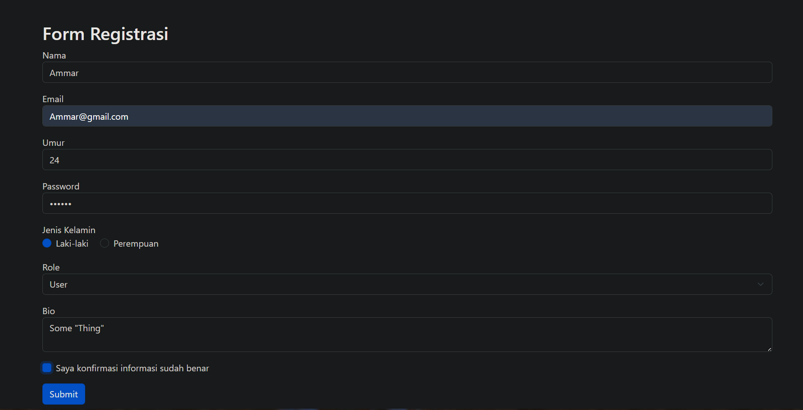

- Hasil submit
    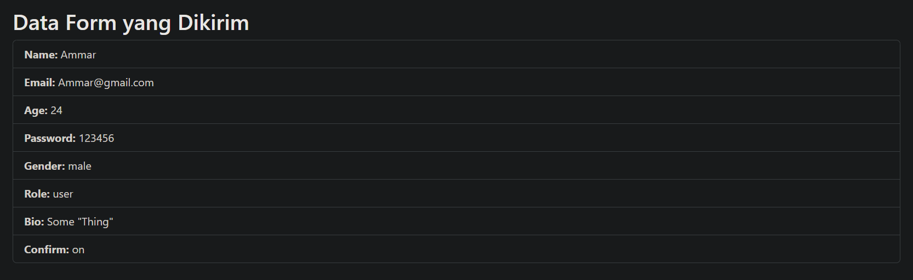

- Form Error (Kosong)
    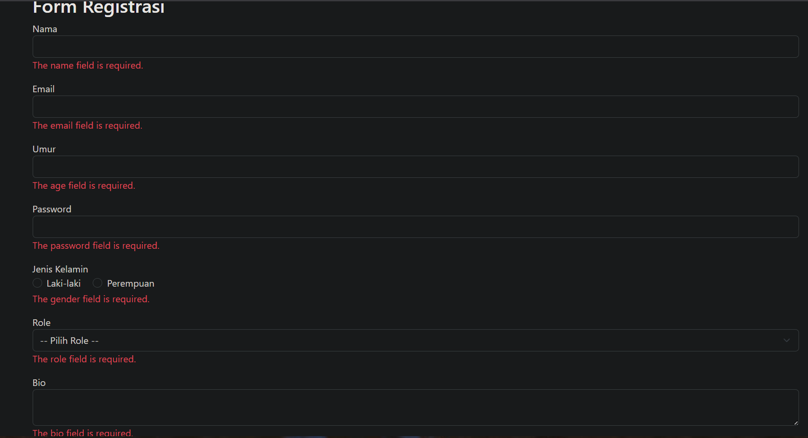

### 2.2 Praktikum 2 – Custom Validation Message

>Langkah-langkah:

1. Pada projek form-app tambahkan route pada routes/web.php.

        use App\Http\Controllers\RegisterController;

        Route::get('/register', [RegisterController::class, 'showForm'])->name('register.show');
        Route::post('/register', [RegisterController::class, 'handleForm'])->name('register.handle');

2. Buat controller RegisterController.

   Buat file RegisterController dengan perintah artisan: 

        php artisan make:controller RegisterController

   Masuk ke file `app/Http/Controllers/RegisterController` dan isikan code berikut pada class RegisterController:

        public function showForm()
        {
            return view('register');
        }

        public function handleForm(Request $request)
        {
            $customMessages = [
                'name.required' => 'Kami perlu tahu nama Anda!',
                'email.required' => 'Email Anda penting bagi kami.',
                'email.email' => 'Hmm... itu tidak terlihat seperti email yang valid.',
                'password.required' => 'Jangan lupa untuk set password.',
                'password.min' => 'Password harus minimal :min karakter.',
                'username.regex' => 'Username hanya boleh berisi huruf dan angka.',
            ];

            $request->validate([
                'name' => 'required|string|max:100',
                'email' => 'required|email',
                'username' => ['required', 'regex:/^[a-zA-Z0-9]+$/'],
                'password' => 'required|min:6',
            ], $customMessages);

            return redirect()->route('register.show')->with('success', 'Registrasi berhasil!');
        }

3. Buat view register.blade.php.

   Buat file `register.blade.php` di `resources\views` lalu masukkan kode berikut:

        <!DOCTYPE html>
        <html>
        <head>
            <title>Form Register</title>
            <link href="https://cdn.jsdelivr.net/npm/bootstrap@5.3.3/dist/css/bootstrap.min.css" rel="stylesheet">
        </head>
        <body class="container mt-5">
            <h2>Contoh Validasi Kustom</h2>
            
            @if (session('success'))
                

                    {{ session('success') }}
                

            @endif

            <form method="POST" action="{{ route('register.handle') }}">
                @csrf
                

                    <label for="name">Nama Lengkap</label>
                    <input name="name" class="form-control" value="{{ old('name') }}">
                    @error('name') 
{{ $message }}
 @enderror
                

                

                    <label for="email">Alamat Email</label>
                    <input name="email" class="form-control" value="{{ old('email') }}">
                    @error('email') 
{{ $message }}
 @enderror
                

                

                    <label for="username">Username</label>
                    <input name="username" class="form-control" value="{{ old('username') }}">
                    @error('username') 
{{ $message }}
 @enderror
                

                

                    <label for="password">Password</label>
                    @error('password') 
{{ $message }}
 @enderror
                    <input type="password" name="password" class="form-control">
                

                <button type="submit" class="btn btn-primary">Register</button>
            </form>
        </body>
        </html>

4. Jalankan aplikasi dan tunjukkan hasil di browser.

   Untuk menjalankan aplikasi kita bisa menggunakan perintah artisan berikut:

        php artisan serve

   lalu ctrl+klik `http://127.0.0.1:8000` sehingga akan diredirect ke web browser.
   
   pada URL masukkan `/register` agar masuk ke halaman web yang telah kita buat.

>Screenshot Hasil:
- Form
    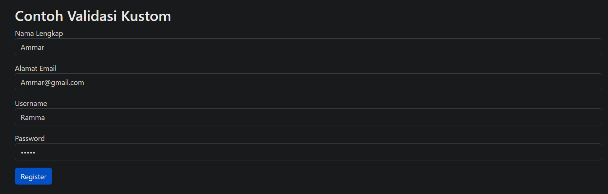

- Berhasil
    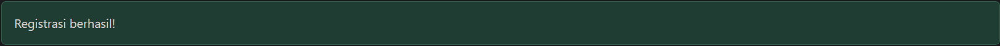

- Form Error (Kosong)
    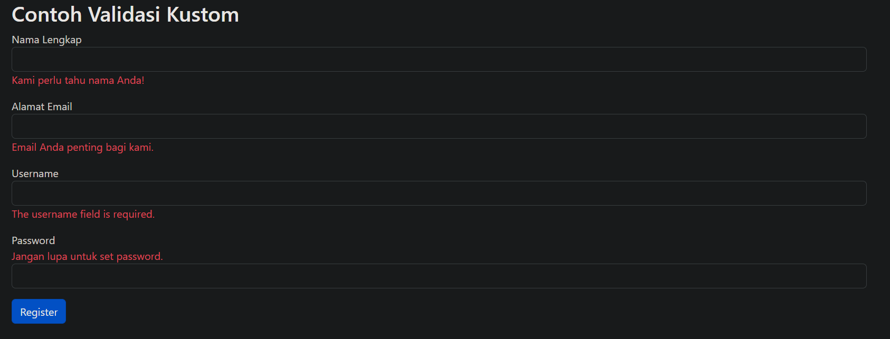

- Form Error (Tidak sesuai Aturan Validasi)
    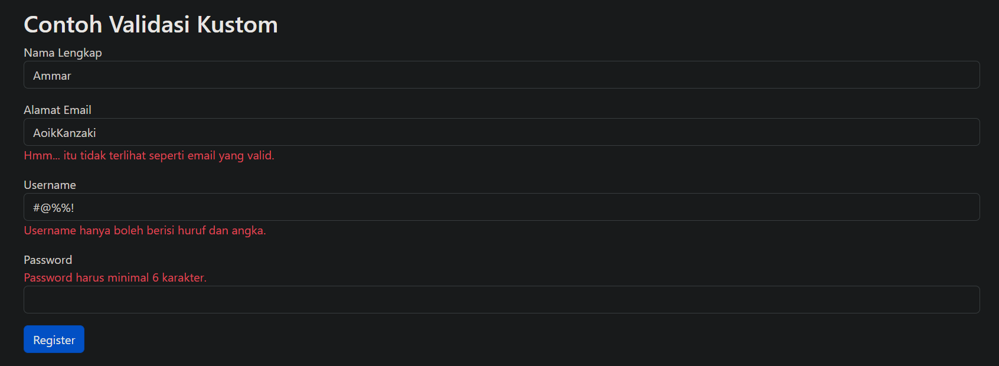

### 2.3 Praktikum 3 – Multi-Step Form Submission

>Langkah-langkah:

1. Buat Projek laravel pada terminal vscode

        laravel new multistep-form-app

    lalu masuk ke dalam folder projek tsb.

        cd multistep-form-app

2. Tambahkan route pada routes/web.php.

        use App\Http\Controllers\MultiStepFormController;

        Route::get('/multistep', [MultiStepFormController::class, 'showStep1'])->name('multistep.step1');
        Route::post('/multistep/step1', [MultiStepFormController::class, 'storeStep1'])->name('multistep.storeStep1');
        Route::get('/multistep/step2', [MultiStepFormController::class, 'showStep2'])->name('multistep.step2');
        Route::post('/multistep/step2', [MultiStepFormController::class, 'storeStep2'])->name('multistep.storeStep2');
        Route::get('/multistep/step3', [MultiStepFormController::class, 'showStep3'])->name('multistep.step3');
        Route::post('/multistep/step3', [MultiStepFormController::class, 'storeStep3'])->name('multistep.storeStep3');
        Route::get('/multistep/summary', [MultiStepFormController::class, 'showSummary'])->name('multistep.summary');
        Route::post('/multistep/complete', [MultiStepFormController::class, 'complete'])->name('multistep.complete');

3. Buat controller MultiStepFormController.

   Buat file MultiStepFormController dengan perintah artisan: 

        php artisan make:controller MultiStepFormController

   Masuk ke file `app/Http/Controllers/MultiStepFormController` dan isikan code berikut pada class MultiStepFormController:

        // Step 1 - Informasi Pribadi
        public function showStep1()
        {
            return view('multistep.step1', [
                'step' => 1,
                'progress' => 0
            ]);
        }

        public function storeStep1(Request $request)
        {
            $validated = $request->validate([
                'full_name' => 'required|string|max:100',
                'email' => 'required|email',
                'phone' => 'required|string|max:15',
                'address' => 'required|string|max:200',
            ]);

            // Simpan data ke session
            session(['step1_data' => $validated]);

            return redirect()->route('multistep.step2');
        }

        // Step 2 - Informasi Pendidikan
        public function showStep2()
        {
            if (!session('step1_data')) {
                return redirect()->route('multistep.step1');
            }

            return view('multistep.step2', [
                'step' => 2,
                'progress' => 33
            ]);
        }

        public function storeStep2(Request $request)
        {
            $validated = $request->validate([
                'education' => 'required|string|max:50',
                'institution' => 'required|string|max:100',
                'graduation_year' => 'required|integer|min:1900|max:' . date('Y'),
                'major' => 'required|string|max:100',
            ]);

            session(['step2_data' => $validated]);

            return redirect()->route('multistep.step3');
        }

        // Step 3 - Pengalaman Kerja
        public function showStep3()
        {
            if (!session('step1_data') || !session('step2_data')) {
                return redirect()->route('multistep.step1');
            }

            return view('multistep.step3', [
                'step' => 3,
                'progress' => 66
            ]);
        }

        public function storeStep3(Request $request)
        {
            $validated = $request->validate([
                'current_job' => 'nullable|string|max:100',
                'company' => 'nullable|string|max:100',
                'experience_years' => 'required|integer|min:0|max:50',
                'skills' => 'required|string|max:200',
            ]);

            session(['step3_data' => $validated]);

            return redirect()->route('multistep.summary');
        }

        // Summary - Ringkasan Data
        public function showSummary()
        {
            $step1Data = session('step1_data');
            $step2Data = session('step2_data');
            $step3Data = session('step3_data');

            if (!$step1Data || !$step2Data || !$step3Data) {
                return redirect()->route('multistep.step1');
            }

            return view('multistep.summary', [
                'step' => 4,
                'progress' => 100,
                'step1Data' => $step1Data,
                'step2Data' => $step2Data,
                'step3Data' => $step3Data
            ]);
        }

        // Complete - Proses Final
        public function complete(Request $request)
        {
            // Di sini Anda bisa menyimpan data ke database
            // Untuk demo, kita hanya akan menampilkan pesan sukses

            $allData = [
                'personal' => session('step1_data'),
                'education' => session('step2_data'),
                'experience' => session('step3_data')
            ];

            // Hapus session data
            $request->session()->forget(['step1_data', 'step2_data', 'step3_data']);

            return view('multistep.complete', [
                'data' => $allData
            ]);
        }

4. Buat layouts directory di `resources\views`
        mkdir resources/views/layouts

5. Buat file `app.blade.php` di `resources\views\layouts` lalu masukkan kode berikut:

        <!DOCTYPE html>
        <html lang="id">
        <head>
            <meta charset="UTF-8">
            <meta name="viewport" content="width=device-width, initial-scale=1.0">
            <title>@yield('title', 'Multi-Step Form')</title>
            <link href="https://cdn.jsdelivr.net/npm/bootstrap@5.3.3/dist/css/bootstrap.min.css" rel="stylesheet">
            
        </head>
        <body>
            <nav class="navbar navbar-dark bg-dark">
                

                    Multi-Step Form Demo
                

            </nav>

            

                @yield('content')
            

            
        </body>
        </html>

4. Buat multistep directory di `resources\views`
        mkdir resources/views/multistep

5. Buat file `step1.blade.php` di `resources\views\multistep` lalu masukkan kode berikut:

        @extends('layouts.app')

        @section('title', 'Step 1 - Informasi Pribadi')

        @section('content')
        

            

                <!-- Progress Bar -->
                

                    

                        

                            
1

                            
Informasi Pribadi

                        

                        

                            
2

                            
Pendidikan

                        

                        

                            
3

                            
Pengalaman

                        

                        

                            
4

                            
Ringkasan

                        

                    

                

                

                    

                        <h4 class="mb-0">Step 1: Informasi Pribadi</h4>
                    

                    

                        <form method="POST" action="{{ route('multistep.storeStep1') }}">
                            @csrf
                            
                            

                                

                                    <label for="full_name" class="form-label">Nama Lengkap *</label>
                                    <input type="text" class="form-control @error('full_name') is-invalid @enderror" 
                                        id="full_name" name="full_name" 
                                        value="{{ old('full_name', session('step1_data.full_name') ?? '') }}" 
                                        required>
                                    @error('full_name')
                                        
{{ $message }}

                                    @enderror
                                

                                
                                

                                    <label for="email" class="form-label">Email *</label>
                                    <input type="email" class="form-control @error('email') is-invalid @enderror" 
                                        id="email" name="email" 
                                        value="{{ old('email', session('step1_data.email') ?? '') }}" 
                                        required>
                                    @error('email')
                                        
{{ $message }}

                                    @enderror
                                

                            

                            

                                

                                    <label for="phone" class="form-label">Nomor Telepon *</label>
                                    <input type="text" class="form-control @error('phone') is-invalid @enderror" 
                                        id="phone" name="phone" 
                                        value="{{ old('phone', session('step1_data.phone') ?? '') }}" 
                                        required>
                                    @error('phone')
                                        
{{ $message }}

                                    @enderror
                                

                                
                                

                                    <label for="address" class="form-label">Alamat *</label>
                                    <input type="text" class="form-control @error('address') is-invalid @enderror" 
                                        id="address" name="address" 
                                        value="{{ old('address', session('step1_data.address') ?? '') }}" 
                                        required>
                                    @error('address')
                                        
{{ $message }}

                                    @enderror
                                

                            

                            

                                

 <!-- Spacer -->
                                <button type="submit" class="btn btn-primary">
                                    Lanjut ke Step 2 <i class="fas fa-arrow-right ms-2"></i>
                                </button>
                            

                        </form>
                    

                

            

        

        @endsection

6. Buat file `step2.blade.php` di `resources\views\multistep` lalu masukkan kode berikut:

        @extends('layouts.app')

        @section('title', 'Step 2 - Informasi Pendidikan')

        @section('content')
        

            

                <!-- Progress Bar -->
                

                    

                        

                            
✓

                            
Informasi Pribadi

                        

                        

                            
2

                            
Pendidikan

                        

                        

                            
3

                            
Pengalaman

                        

                        

                            
4

                            
Ringkasan

                        

                    

                

                

                    

                        <h4 class="mb-0">Step 2: Informasi Pendidikan</h4>
                    

                    

                        <form method="POST" action="{{ route('multistep.storeStep2') }}">
                            @csrf
                            
                            

                                <label for="education" class="form-label">Tingkat Pendidikan *</label>
                                <select class="form-select @error('education') is-invalid @enderror" 
                                        id="education" name="education" required>
                                    <option value="">Pilih Tingkat Pendidikan</option>
                                    <option value="SMA" {{ old('education', session('step2_data.education') ?? '') == 'SMA' ? 'selected' : '' }}>SMA</option>
                                    <option value="D3" {{ old('education', session('step2_data.education') ?? '') == 'D3' ? 'selected' : '' }}>D3</option>
                                    <option value="S1" {{ old('education', session('step2_data.education') ?? '') == 'S1' ? 'selected' : '' }}>S1</option>
                                    <option value="S2" {{ old('education', session('step2_data.education') ?? '') == 'S2' ? 'selected' : '' }}>S2</option>
                                    <option value="S3" {{ old('education', session('step2_data.education') ?? '') == 'S3' ? 'selected' : '' }}>S3</option>
                                </select>
                                @error('education')
                                    
{{ $message }}

                                @enderror
                            

                            

                                

                                    <label for="institution" class="form-label">Nama Institusi *</label>
                                    <input type="text" class="form-control @error('institution') is-invalid @enderror" 
                                        id="institution" name="institution" 
                                        value="{{ old('institution', session('step2_data.institution') ?? '') }}" 
                                        required>
                                    @error('institution')
                                        
{{ $message }}

                                    @enderror
                                

                                
                                

                                    <label for="graduation_year" class="form-label">Tahun Lulus *</label>
                                    <input type="number" class="form-control @error('graduation_year') is-invalid @enderror" 
                                        id="graduation_year" name="graduation_year" 
                                        value="{{ old('graduation_year', session('step2_data.graduation_year') ?? '') }}" 
                                        min="1900" max="{{ date('Y') }}" required>
                                    @error('graduation_year')
                                        
{{ $message }}

                                    @enderror
                                

                            

                            

                                <label for="major" class="form-label">Jurusan *</label>
                                <input type="text" class="form-control @error('major') is-invalid @enderror" 
                                    id="major" name="major" 
                                    value="{{ old('major', session('step2_data.major') ?? '') }}" 
                                    required>
                                @error('major')
                                    
{{ $message }}

                                @enderror
                            

                            

                                <a href="{{ route('multistep.step1') }}" class="btn btn-secondary">
                                    <i class="fas fa-arrow-left me-2"></i>Kembali
                                </a>
                                <button type="submit" class="btn btn-primary">
                                    Lanjut ke Step 3 <i class="fas fa-arrow-right ms-2"></i>
                                </button>
                            

                        </form>
                    

                

            

        

        @endsection

7. Buat file `step3.blade.php` di `resources\views\multistep` lalu masukkan kode berikut:

        @extends('layouts.app')

        @section('title', 'Step 3 - Pengalaman Kerja')

        @section('content')
        

            

                <!-- Progress Bar -->
                

                    

                        

                            
✓

                            
Informasi Pribadi

                        

                        

                            
✓

                            
Pendidikan

                        

                        

                            
3

                            
Pengalaman

                        

                        

                            
4

                            
Ringkasan

                        

                    

                

                

                    

                        <h4 class="mb-0">Step 3: Pengalaman Kerja</h4>
                    

                    

                        <form method="POST" action="{{ route('multistep.storeStep3') }}">
                            @csrf
                            
                            

                                

                                    <label for="current_job" class="form-label">Pekerjaan Saat Ini</label>
                                    <input type="text" class="form-control @error('current_job') is-invalid @enderror" 
                                        id="current_job" name="current_job" 
                                        value="{{ old('current_job', session('step3_data.current_job') ?? '') }}">
                                    @error('current_job')
                                        
{{ $message }}

                                    @enderror
                                

                                
                                

                                    <label for="company" class="form-label">Perusahaan</label>
                                    <input type="text" class="form-control @error('company') is-invalid @enderror" 
                                        id="company" name="company" 
                                        value="{{ old('company', session('step3_data.company') ?? '') }}">
                                    @error('company')
                                        
{{ $message }}

                                    @enderror
                                

                            

                            

                                

                                    <label for="experience_years" class="form-label">Pengalaman Kerja (Tahun) *</label>
                                    <input type="number" class="form-control @error('experience_years') is-invalid @enderror" 
                                        id="experience_years" name="experience_years" 
                                        value="{{ old('experience_years', session('step3_data.experience_years') ?? '') }}" 
                                        min="0" max="50" required>
                                    @error('experience_years')
                                        
{{ $message }}

                                    @enderror
                                

                            

                            

                                <label for="skills" class="form-label">Keahlian/Keterampilan *</label>
                                <textarea class="form-control @error('skills') is-invalid @enderror" 
                                        id="skills" name="skills" rows="3" 
                                        placeholder="Contoh: PHP, Laravel, JavaScript, MySQL..." 
                                        required>{{ old('skills', session('step3_data.skills') ?? '') }}</textarea>
                                @error('skills')
                                    
{{ $message }}

                                @enderror
                                
Pisahkan setiap keahlian dengan koma

                            

                            

                                <a href="{{ route('multistep.step2') }}" class="btn btn-secondary">
                                    <i class="fas fa-arrow-left me-2"></i>Kembali
                                </a>
                                <button type="submit" class="btn btn-primary">
                                    Lihat Ringkasan <i class="fas fa-arrow-right ms-2"></i>
                                </button>
                            

                        </form>
                    

                

            

        

        @endsection

8. Buat file `complete.blade.php` di `resources\views\multistep` lalu masukkan kode berikut:

        @extends('layouts.app')

        @section('title', 'Pendaftaran Selesai')

        @section('content')
        

            

                

                    

                        

                            <i class="fas fa-check-circle text-success" style="font-size: 4rem;"></i>
                        

                        <h2 class="card-title text-success mb-3">Pendaftaran Berhasil!</h2>
                        

                            Terima kasih telah melengkapi formulir pendaftaran. Data Anda telah berhasil disimpan.
                        

                        
                        

                            <h6><i class="fas fa-envelope me-2"></i>Informasi Penting:</h6>
                            <ul class="mb-0">
                                <li>Anda akan menerima email konfirmasi dalam 24 jam</li>
                                <li>Proses verifikasi membutuhkan waktu 2-3 hari kerja</li>
                                <li>Tim kami akan menghubungi Anda untuk langkah selanjutnya</li>
                            </ul>
                        

                        

                            <a href="{{ route('multistep.step1') }}" class="btn btn-primary me-2">
                                <i class="fas fa-plus me-2"></i>Daftar Lagi
                            </a>
                            <a href="/" class="btn btn-outline-secondary">
                                <i class="fas fa-home me-2"></i>Kembali ke Home
                            </a>
                        

                    

                

                <!-- Debug Data (bisa dihapus di production) -->
                @if(env('APP_DEBUG'))
                

                    

                        <h6 class="mb-0">Data yang Disimpan (Debug)</h6>
                    

                    

                        <pre>{{ json_encode($data, JSON_PRETTY_PRINT) }}</pre>
                    

                

                @endif
            

        

        @endsection

9. Buat file `summary.blade.php` di `resources\views\multistep` lalu masukkan kode berikut:

        @extends('layouts.app')

        @section('title', 'Ringkasan Data')

        @section('content')
        

            

                <!-- Progress Bar -->
                

                    

                        

                            
✓

                            
Informasi Pribadi

                        

                        

                            
✓

                            
Pendidikan

                        

                        

                            
✓

                            
Pengalaman

                        

                        

                            
4

                            
Ringkasan

                        

                    

                

                

                    

                        <h4 class="mb-0">Ringkasan Data Anda</h4>
                    

                    

                        <!-- Informasi Pribadi -->
                        

                            <h5 class="border-bottom pb-2">
                                <i class="fas fa-user me-2"></i>Informasi Pribadi
                                <a href="{{ route('multistep.step1') }}" class="btn btn-sm btn-outline-primary float-end">Edit</a>
                            </h5>
                            

                                

                                    <strong>Nama Lengkap:</strong> 
                                    {{ $step1Data['full_name'] }}
                                

                                

                                    <strong>Email:</strong> 
                                    {{ $step1Data['email'] }}
                                

                            

                            

                                

                                    <strong>Telepon:</strong> 
                                    {{ $step1Data['phone'] }}
                                

                                

                                    <strong>Alamat:</strong> 
                                    {{ $step1Data['address'] }}
                                

                            

                        

                        <!-- Informasi Pendidikan -->
                        

                            <h5 class="border-bottom pb-2">
                                <i class="fas fa-graduation-cap me-2"></i>Informasi Pendidikan
                                <a href="{{ route('multistep.step2') }}" class="btn btn-sm btn-outline-primary float-end">Edit</a>
                            </h5>
                            

                                

                                    <strong>Tingkat Pendidikan:</strong> 
                                    {{ $step2Data['education'] }}
                                

                                

                                    <strong>Institusi:</strong> 
                                    {{ $step2Data['institution'] }}
                                

                                

                                    <strong>Tahun Lulus:</strong> 
                                    {{ $step2Data['graduation_year'] }}
                                

                            

                            

                                

                                    <strong>Jurusan:</strong> 
                                    {{ $step2Data['major'] }}
                                

                            

                        

                        <!-- Pengalaman Kerja -->
                        

                            <h5 class="border-bottom pb-2">
                                <i class="fas fa-briefcase me-2"></i>Pengalaman Kerja
                                <a href="{{ route('multistep.step3') }}" class="btn btn-sm btn-outline-primary float-end">Edit</a>
                            </h5>
                            

                                

                                    <strong>Pekerjaan Saat Ini:</strong> 
                                    {{ $step3Data['current_job'] ?? 'Tidak disebutkan' }}
                                

                                

                                    <strong>Perusahaan:</strong> 
                                    {{ $step3Data['company'] ?? 'Tidak disebutkan' }}
                                

                            

                            

                                

                                    <strong>Pengalaman Kerja:</strong> 
                                    {{ $step3Data['experience_years'] }} tahun
                                

                                

                                    <strong>Keahlian:</strong> 
                                    {{ $step3Data['skills'] }}
                                

                            

                        

                        

                            <i class="fas fa-info-circle me-2"></i>
                            <strong>Perhatian:</strong> Pastikan semua data sudah benar sebelum mengirim.
                        

                        <form method="POST" action="{{ route('multistep.complete') }}">
                            @csrf
                            

                                <a href="{{ route('multistep.step3') }}" class="btn btn-secondary">
                                    <i class="fas fa-arrow-left me-2"></i>Kembali
                                </a>
                                <button type="submit" class="btn btn-success">
                                    <i class="fas fa-check me-2"></i>Kirim Data
                                </button>
                            

                        </form>
                    

                

            

        

        @endsection

10. Jalankan aplikasi dan tunjukkan hasil di browser.

   Untuk menjalankan aplikasi kita bisa menggunakan perintah artisan berikut:

        php artisan serve

   lalu ctrl+klik `http://127.0.0.1:8000` sehingga akan diredirect ke web browser.
   
   pada URL masukkan `/multistep` agar masuk ke halaman web yang telah kita buat.

>Screenshot Hasil:
- Form Step 1
    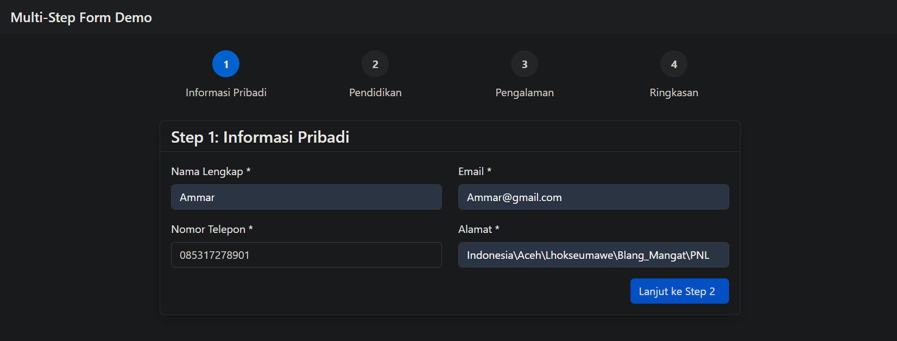

- Form Step 2
    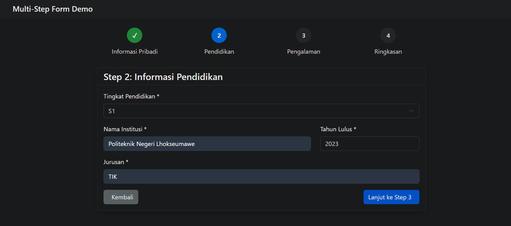

- Form Step 3
    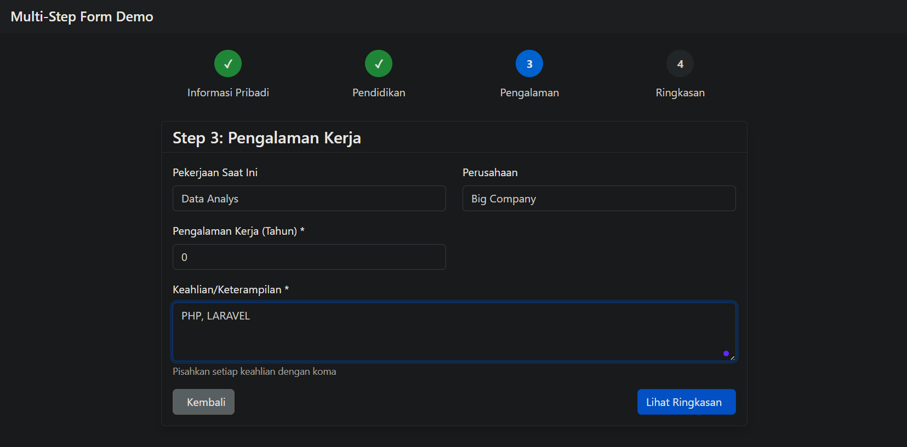

- Ringkasan data Form (Sebelum submit)
    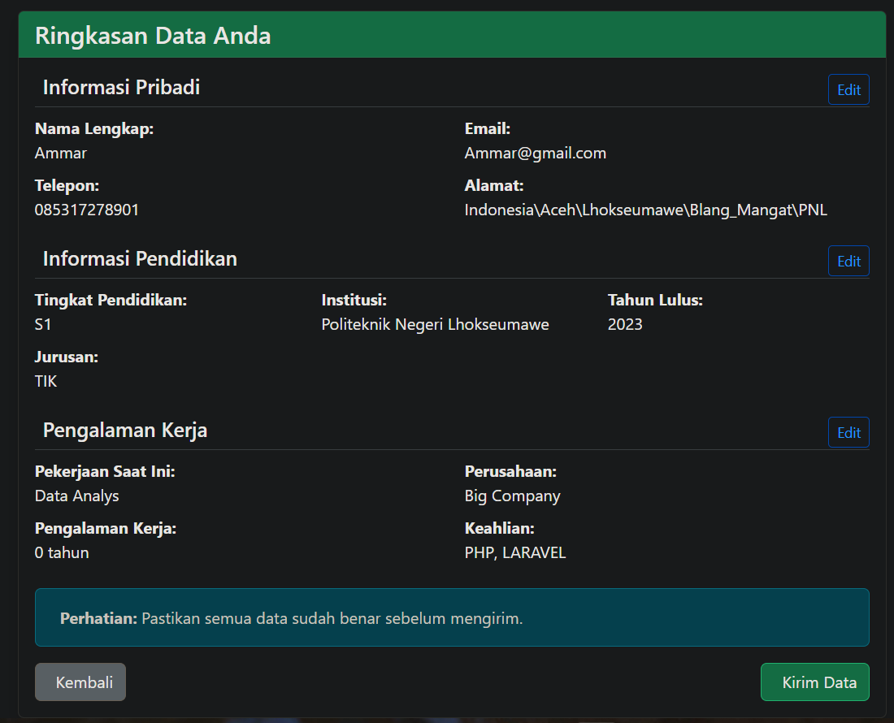

- Selesai submit
    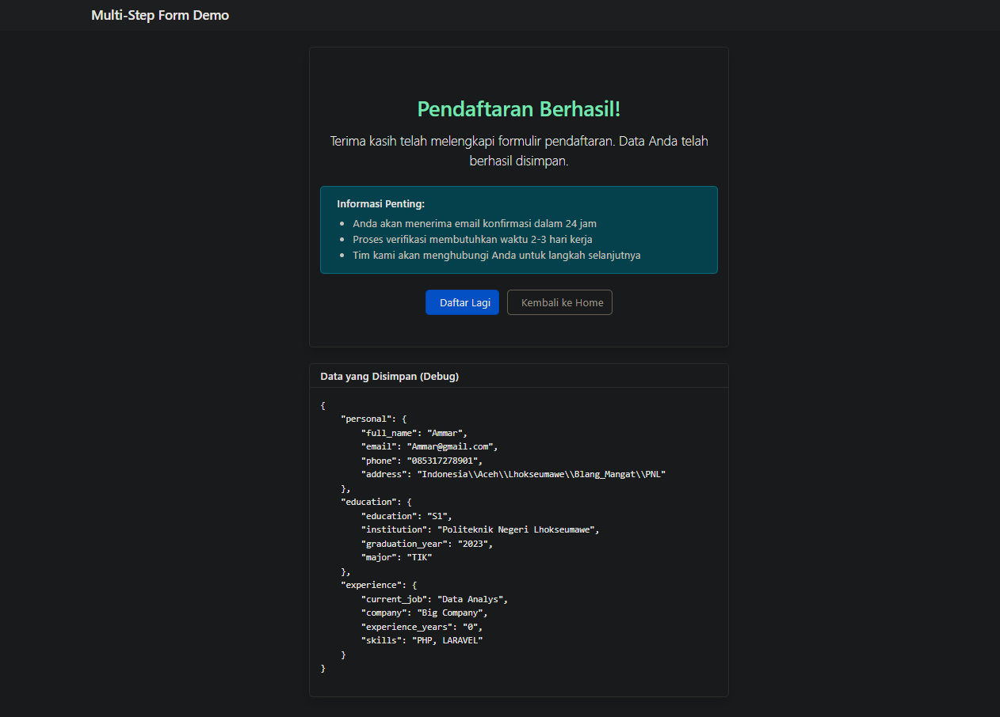

---

## 3. Hasil dan Pembahasan

- Semua form berhasil diproses dengan validasi sesuai rule yang ditentukan.

- Kesalahan input langsung ditangani oleh sistem validasi Laravel dengan pesan error yang jelas.

- CSRF protection bekerja dengan baik, mencegah request tanpa token yang sah.

- Fitur old() memudahkan pengguna karena input sebelumnya tidak hilang saat validasi gagal.

- Pada multi-step form, session digunakan untuk menjaga data antar langkah dengan lancar.

---

## 4. Kesimpulan

1. Laravel menyediakan sistem form handling yang kuat dan aman, lengkap dengan validasi otomatis dan CSRF protection.

2. Mekanisme validasi Laravel sangat fleksibel — bisa sederhana di controller atau terpisah di form request.

3. Penerapan multi-step form dengan session menunjukkan bahwa Laravel mampu mengelola data kompleks dengan mudah.

4. Kombinasi validasi, error feedback, dan UX-friendly form meningkatkan kualitas aplikasi web modern.

---

## 5. Referensi

- Laravel Official Documentation — https://laravel.com/docs/12.x/validation

- Modul 2 - Laravel Fundamentals - https://hackmd.io/@mohdrzu/HJWzYp7Reg

---