# Laporan Modul 6: Model dan Laravel Eloquent
**Mata Kuliah:** Workshop Web Lanjut   
**Nama:** Ammar  
**NIM:** 2024573010129  
**Kelas:** TI2B  

---

## Abstrak
Laporan ini membahas konsep `Model` dan `Eloquent ORM` pada Laravel yang berperan dalam menghubungkan aplikasi dengan database secara efisien menggunakan pendekatan berorientasi objek. Melalui praktikum ini, dilakukan implementasi tiga proyek: `Model Binding Form`, `DTO (Data Transfer Object)`, dan Aplikasi Todo CRUD menggunakan `MySQL`. Hasil praktikum menunjukkan bahwa penggunaan `Eloquent` dan `model` membuat manajemen data lebih terstruktur, efisien, serta mudah dipelihara.

---

## 1. Dasar Teori
### Model di Laravel

Model adalah bagian dari arsitektur `MVC` (Model-View-Controller) yang merepresentasikan data dan logika bisnis aplikasi. Model bertugas berinteraksi dengan database, baik untuk mengambil, menambah, memperbarui, maupun menghapus data.

Laravel menggunakan `Eloquent ORM` (Object Relational Mapping) yang memudahkan developer dalam melakukan operasi database menggunakan sintaks PHP berorientasi objek, bukan query SQL secara langsung.

**Contoh membuat model:**

    php artisan make:model Product
Kode ini akan membuat file model `Product.php` di direktori `app/Models`.

**Contoh penggunaan model:**

        namespace App\Models;

        use Illuminate\Database\Eloquent\Model;

        class Product extends Model
        {
            protected $fillable = ['name', 'price', 'stock'];
        }

### Entities dan POCO (Plain Old Class Object)

Laravel tidak secara ketat menerapkan konsep entitas seperti pada `Domain-Driven Design`, tetapi model dapat diperlakukan sebagai entitas yang merepresentasikan logika bisnis.

**Contoh POCO:**

    class ProductEntity
    {
        public function __construct(
            public string $name,
            public float $price,
            public int $stock,
        ) {}
    }
Kelas ini dapat digunakan secara independen tanpa ketergantungan pada framework Laravel.

### Data Transfer Object (DTO)

DTO digunakan untuk mentransfer data antar lapisan aplikasi dalam format terstruktur. DTO membantu memisahkan data mentah dari logika bisnis dan meningkatkan keterbacaan kode.

**Contoh DTO:**

    namespace App\DTO;

    class ProductDTO
    {
        public function __construct(
            public string $name,
            public float $price,
            public int $stock,
        ) {}

        public static function fromRequest(array $data): self
        {
            return new self(
                $data['name'],
                $data['price'],
                $data['stock']
            );
        }
    }

### Repository Pattern

Repository berfungsi sebagai lapisan abstraksi untuk mengelola logika akses data, sehingga controller tidak berinteraksi langsung dengan database.

**Contoh Interface Repository:**

    interface ProductRepositoryInterface
    {
        public function all();
        public function find(int $id);
        public function create(array $data);
    }

**Contoh Implementasi:**

    use App\Models\Product;

    class ProductRepository implements ProductRepositoryInterface
    {
        public function all() { return Product::all(); }
        public function find(int $id) { return Product::find($id); }
        public function create(array $data) { return Product::create($data); }
    }

---

## 2. Langkah-Langkah Praktikum
### 2.1 Praktikum 1 – Model Binding Form (Tanpa Database)

>Langkah-langkah:

1. Buat Projek laravel pada terminal vscode

        laravel new model-app

    lalu masuk ke dalam folder projek tsb.

        cd model-app

2. Tambahkan route pada routes/web.php.

        use Illuminate\Support\Facades\Route;

        Route::get('/product/create', [ProductController::class, 'create'])->name('product.create');
        Route::post('/product/result', [ProductController::class, 'result'])->name('product.result');

3. Buat ViewModels directory di `app\`
        mkdir app/ViewModels

4. Buat file ProductViewModel dengan perintah touch: 

        touch app/ViewModels/ProductViewModel.php

   Masuk ke file `app/ViewModels/ProductViewModel` dan isikan code berikut pada class ProductViewModel:

        public string $name;
        public float $price;
        public string $description;

        public function __construct(string $name = '', float $price = 0, string $description = '')
        {
            $this->name = $name;
            $this->price = $price;
            $this->description = $description;
        }

        public static function fromRequest(array $data): self
        {
            return new self(
                $data['name'] ?? '',
                (float)($data['price'] ?? 0),
                $data['description'] ?? ''
            );
        }

5. Buat controller ProductController.

   Buat file ProductController dengan perintah artisan: 

        php artisan make:controller ProductController

   Masuk ke file `app/Http/Controllers/ProductController` dan isikan code berikut pada class ProductController:

        public function create()
        {
            return view('product.create');
        }
        public function result(Request $request)
        {
            $product = ProductViewModel::fromRequest($request->all());
            return view('product.result', compact('product'));
        }

6. Buat product directory di `resources\views`
        mkdir resources/views/product

7. Buat file create.blade.php dengan perintah touch: 

        touch resources/views/product/create.blade.php

   Masuk ke file `resources/views/product/create.blade.php` dan isikan code berikut:

        <!DOCTYPE html>
        <html>
        <head>
            <title>Create Product</title>
            <link href="https://cdn.jsdelivr.net/npm/bootstrap@5.3.3/dist/css/bootstrap.min.css" rel="stylesheet">
        </head>
        <body class="container py-5">
            <h2>Create Product (No Database)</h2>
            <form method="POST" action="{{ route('product.result') }}">
                @csrf
                

                    <label class="form-label">Name</label>
                    <input name="name" class="form-control" required>
                

                

                    <label class="form-label">Price</label>
                    <input name="price" type="number" step="0.01" class="form-control" required>
                

                

                    <label class="form-label">Description</label>
                    <textarea name="description" class="form-control"></textarea>
                

                <button type="submit" class="btn btn-primary">Submit Product</button>
            </form>
        </body>
        </html>

9. Buat file result.blade.php dengan perintah touch: 

        touch resources/views/product/result.blade.php

   Masuk ke file `resources/views/product/result.blade.php` dan isikan code berikut:

        <!DOCTYPE html>
        <html>
        <head>
            <title>Product Result</title>
            <link href="https://cdn.jsdelivr.net/npm/bootstrap@5.3.3/dist/css/bootstrap.min.css" rel="stylesheet">
        </head>
        <body class="container py-5">
            <h2>Submitted Product Details</h2>
            <ul class="list-group">
                <li class="list-group-item"><strong>Name:</strong> {{ $product->name }}</li>
                <li class="list-group-item"><strong>Price:</strong> ${{ number_format($product->price, 2) }}</li>
                <li class="list-group-item"><strong>Description:</strong> {{ $product->description }}</li>
            </ul>
            <a href="{{ route('product.create') }}" class="btn btn-link mt-3">Submit Another Product</a>
        </body>
        </html>

5. Jalankan aplikasi dan tunjukkan hasil di browser.

   Untuk menjalankan aplikasi kita bisa menggunakan perintah artisan berikut:

        php artisan serve

   lalu ctrl+klik `http://127.0.0.1:8000` sehingga akan diredirect ke web browser.
   
   pada URL masukkan `/product/create` agar masuk ke halaman web yang telah kita buat.

>Screenshot Hasil:
- Form

    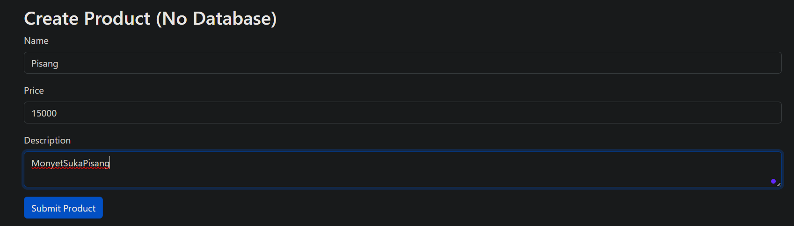

- Hasil submit

    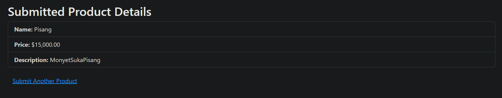

### 2.2 Praktikum 2 – Data Transfer Object (DTO)

>Langkah-langkah:

1. Buat Projek laravel pada terminal vscode

        laravel new dto-app

    lalu masuk ke dalam folder projek tsb.

        cd dto-app

2. Tambahkan route pada routes/web.php.

        use App\Http\Controllers\ProductController;

        Route::get('/product/create', [ProductController::class, 'create'])->name('product.create');
        Route::post('/product/result', [ProductController::class, 'result'])->name('product.result');

3. Buat DTO directory di `app\`
        mkdir app/DTO

4. Buat file ProductDTO dengan perintah touch: 

        touch app/DTO/ProductDTO.php

   Masuk ke file `app/ViewModels/ProductDTO` dan isikan code berikut pada class ProductDTO:

        public string $name;
        public float $price;
        public string $description;

        public function __construct(string $name, float $price, string $description)
        {
            $this->name = $name;
            $this->price = $price;
            $this->description = $description;
        }

        public static function fromRequest(array $data): self
        {
            return new self(
                $data['name'] ?? '',
                (float)($data['price'] ?? 0),
                $data['description'] ?? ''
            );
        }

5. Buat controller ProductController.

   Buat file ProductController dengan perintah artisan: 

        php artisan make:controller ProductController

   Masuk ke file `app/Http/Controllers/ProductController` dan isikan code berikut pada class ProductController:

        public function create()
        {
            return view('product.create');
        }

        public function result(Request $request)
        {
            $dto = ProductDTO::fromRequest($request->all());
            $service = new ProductService();
            $product = $service->display($dto);

            return view('product.result', compact('product'));
        }

6. Buat product directory di `resources\views`
        mkdir resources/views/product

7. Buat file create.blade.php dengan perintah touch: 

        touch resources/views/product/create.blade.php

   Masuk ke file `resources/views/product/create.blade.php` dan isikan code berikut:

        <!DOCTYPE html>
        <html>
        <head>
            <title>Create Product DTO</title>
            <link href="https://cdn.jsdelivr.net/npm/bootstrap@5.3.3/dist/css/bootstrap.min.css" rel="stylesheet">
        </head>
        <body class="container py-5">
            

                

                    <h2 class="mb-4">Create Product</h2>
                    <form method="POST" action="{{ route('product.result') }}">
                        @csrf
                        

                            <label class="form-label">Name</label>
                            <input name="name" class="form-control" required>
                        

                        

                            <label class="form-label">Price</label>
                            <input name="price" type="number" step="0.01" class="form-control" required>
                        

                        

                            <label class="form-label">Description</label>
                            <textarea name="description" class="form-control" rows="3"></textarea>
                        

                        <button type="submit" class="btn btn-primary">Submit Product</button>
                    </form>
                

            

        </body>
        </html>

9. Buat file result.blade.php dengan perintah touch: 

        touch resources/views/product/result.blade.php

   Masuk ke file `resources/views/product/result.blade.php` dan isikan code berikut:

        <!DOCTYPE html>
        <html>
        <head>
            <title>Product Result</title>
            <link href="https://cdn.jsdelivr.net/npm/bootstrap@5.3.3/dist/css/bootstrap.min.css" rel="stylesheet">
        </head>
        <body class="container py-5">
            

                

                    <h2 class="mb-4">Product DTO Result</h2>
                    

                        

                            <h5 class="card-title mb-0">Product Details</h5>
                        

                        <ul class="list-group list-group-flush">
                            <li class="list-group-item">
                                <strong>Name:</strong> {{ $product['name'] }}
                            </li>
                            <li class="list-group-item">
                                <strong>Price:</strong> ${{ number_format($product['price'], 2) }}
                            </li>
                            <li class="list-group-item">
                                <strong>Description:</strong> {{ $product['description'] }}
                            </li>
                        </ul>
                    

                    <a href="{{ route('product.create') }}" class="btn btn-secondary mt-3">Submit Another Product</a>
                

            

        </body>
        </html>

5. Jalankan aplikasi dan tunjukkan hasil di browser.

   Untuk menjalankan aplikasi kita bisa menggunakan perintah artisan berikut:

        php artisan serve

   lalu ctrl+klik `http://127.0.0.1:8000` sehingga akan diredirect ke web browser.
   
   pada URL masukkan `/product/create` agar masuk ke halaman web yang telah kita buat.

>Screenshot Hasil:
- Form

    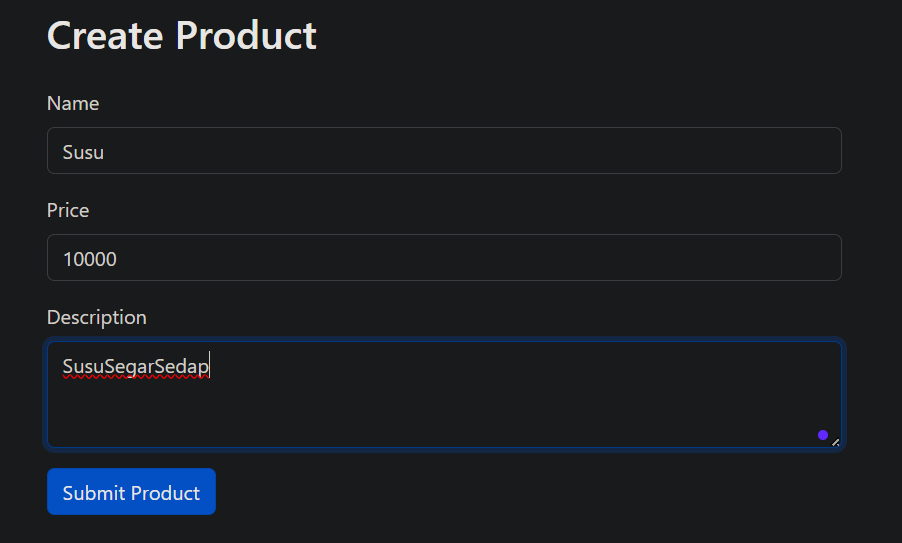

- Hasil submit

    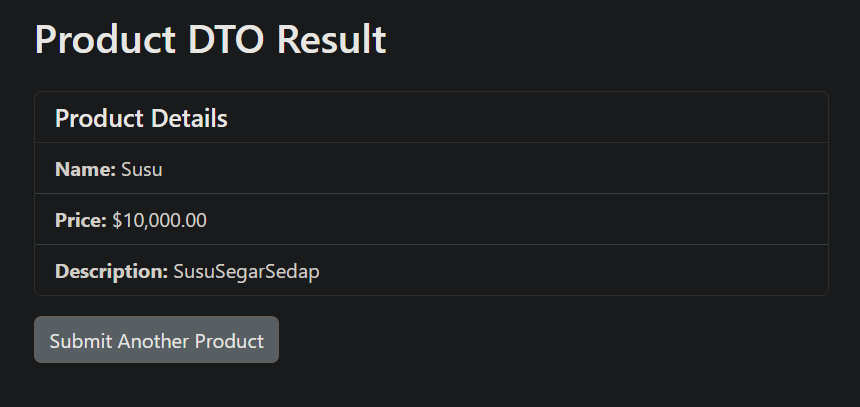

### 2.3 Praktikum 3 – Aplikasi Todo CRUD dengan Eloquent ORM dan MySQL

>Langkah-langkah:

1. Buat Projek laravel pada terminal vscode

        laravel new todo-app-mysql

    lalu masuk ke dalam folder projek tsb.

        cd todo-app-mysql

    pada penginstalan 
    pilih mysql sebagai database lalu
    pilih **no** ketika ditanya migration database

2. Buat database TodoDB di Php My Admin atau  terminal

        CREATE DATABASE tododb;

3. Install Dependency MySQL

        composer require doctrine/dbal

4. Sesuaikan seperti berikut pada file .env

        DB_CONNECTION=mysql
        DB_HOST=127.0.0.1
        DB_PORT=3306
        DB_DATABASE=tododb
        DB_USERNAME=<username database anda>
        DB_PASSWORD=<password database anda>

    lalu bersihkan config cache menggunakan perintah `artisan`:
        
        php artisan config:clear

5. Buat Migrasi untuk tabel todos

    dengan perintah artisan:

        php artisan make:migration create_tabel_todos

    Buka file yang telah dibuat di `database/migrations/YYYY_MM_DD_create_todos_table.php` lalu ganti dengan:

        <?php

        use Illuminate\Database\Migrations\Migration;
        use Illuminate\Database\Schema\Blueprint;
        use Illuminate\Support\Facades\Schema;

        return new class extends Migration {
            public function up()
            {
                Schema::create('todos', function (Blueprint $table) {
                    $table->id();
                    $table->string('task');
                    $table->boolean('completed')->default(false);
                    $table->timestamps();
                });
            }

            public function down()
            {
                Schema::dropIfExists('todos');
            }
        };
    
    Jalankan Migrasi dengan perintah artisan
        
        php artisan migrate

6. Buat Migrasi untuk tabel todos

    dengan perintah artisan:

        php artisan make:seeder TodoSeeder

    Buka file yang telah dibuat di `database/seeder/TodoSeeder.php` lalu ganti dengan:

        <?php

        namespace Database\Seeders;

        use Illuminate\Database\Console\Seeds\WithoutModelEvents;
        use Illuminate\Database\Seeder;
        use Illuminate\Support\Facades\DB;
        use Carbon\Carbon;

        class TodoSeeder extends Seeder
        {
            public function run()
            {
                DB::table('todos')->insert([
                    [
                        'task' => 'Belanja bahan makanan',
                        'completed' => false,
                        'created_at' => Carbon::now(),
                        'updated_at' => Carbon::now()
                    ],
                    [
                        'task' => 'Beli buah-buahan',
                        'completed' => false,
                        'created_at' => Carbon::now(),
                        'updated_at' => Carbon::now()
                    ],
                    [
                        'task' => 'Selesaikan proyek Laravel',
                        'completed' => true,
                        'created_at' => Carbon::now(),
                        'updated_at' => Carbon::now()
                    ],
                ]);
            }
        }
    
    Jalankan Seeder dengan perintah artisan
        
        php artisan db:seed

7. Ganti isi route pada routes/web.php.

        <?php

        use Illuminate\Support\Facades\Route;   
        use App\Http\Controllers\TodoController;

        Route::get('/', [TodoController::class, 'index'])->name('todos.index');
        Route::get('/todos/create', [TodoController::class, 'create'])->name('todos.create');
        Route::post('/todos', [TodoController::class, 'store'])->name('todos.store');
        Route::get('/todos/{todo}', [TodoController::class, 'show'])->name('todos.show');
        Route::get('/todos/{todo}/edit', [TodoController::class, 'edit'])->name('todos.edit');
        Route::patch('/todos/{todo}', [TodoController::class, 'update'])->name('todos.update');
        Route::delete('/todos/{todo}', [TodoController::class, 'destroy'])->name('todos.destroy');

8. Buat Model Todo.

   Buat file Todo dengan perintah artisan: 

        php artisan make:model Todo

   Masuk ke file `app/Models/Todo` dan isikan code berikut pada class Todo:

        use HasFactory;

        protected $fillable = ['task', 'completed'];

9. Buat controller TodoController.

    Buat file TodoController dengan perintah artisan: 

        php artisan make:controller TodoController

    Masuk ke file `app/Http/Controllers/TodoController` dan isikan code berikut pada class TodoController:

        public function index()
        {
            $todos = Todo::all();
            return view('todos.index', compact('todos'));
        }

        public function create()
        {
            return view('todos.create');
        }

        public function store(Request $request)
        {
            $request->validate(['task' => 'required|string']);
            Todo::create(['task' => $request->task]);
            return redirect()->route('todos.index')->with('success', 'Task added successfully!');
        }

        public function show(Todo $todo)
        {
            return view('todos.show', compact('todo'));
        }

        public function edit(Todo $todo)
        {
            return view('todos.edit', compact('todo'));
        }

        public function update(Request $request, Todo $todo)
        {
            $request->validate(['task' => 'required|string']);
            $todo->update(['task' => $request->task]);
            return redirect()->route('todos.index')->with('success', 'Task updated successfully!');
        }

        public function destroy(Todo $todo)
        {
            $todo->delete();
            return redirect()->route('todos.index')->with('success', 'Task deleted successfully!');
        }

10. Buat layouts directory di `resources\views`
        mkdir resources/views/layouts

11. Buat file app.blade.php dengan perintah touch: 

        touch resources/views/layouts/app.blade.php

    Masuk ke file `resources/views/layouts/app.blade.php` dan isikan code berikut:

        <!DOCTYPE html>
        <html lang="en">
        <head>
            <meta charset="UTF-8">
            <meta name="viewport" content="width=device-width, initial-scale=1.0">
            <title>@yield('title', 'Todo App')</title>
            <link href="https://cdn.jsdelivr.net/npm/bootstrap@5.3.3/dist/css/bootstrap.min.css" rel="stylesheet">
        </head>
        <body class="container mt-4">

            <h1 class="text-center mb-4">Laravel 12 Todo App</h1>

            @if(session('success'))
                
{{ session('success') }}

            @endif

            <nav class="mb-3">
                <a href="{{ route('todos.index') }}" class="btn btn-primary">Todo List</a>
                <a href="{{ route('todos.create') }}" class="btn btn-success">Add New Task</a>
            </nav>

            @yield('content')

        </body>
        </html>

12. Buat todos directory di `resources\views`
        mkdir resources/views/todos

13. Buat file create.blade.php dengan perintah touch: 

        touch resources/views/todos/create.blade.php

    Masuk ke file `resources/views/todos/create.blade.php` dan isikan code berikut:

        @extends('layouts.app')

        @section('title', 'Buat Task Baru')

        @section('content')
            <h2>Buat Task Baru</h2>

            <form action="{{ route('todos.store') }}" method="POST" class="mt-3">
                @csrf
                

                    <label for="task" class="form-label">Nama Task</label>
                    <input type="text" name="task" id="task" class="form-control" required>
                

                <button type="submit" class="btn btn-success">Tambah Task</button>
                <a href="{{ route('todos.index') }}" class="btn btn-secondary">Kembali ke Daftar</a>
            </form>

        @endsection

14. Buat file edit.blade.php dengan perintah touch: 

        touch resources/views/todos/edit.blade.php

    Masuk ke file `resources/views/todos/edit.blade.php` dan isikan code berikut:

        @extends('layouts.app')
        @section('title', 'Edit Task')

        @section('content')
            <h2>Edit Task</h2>

            <form action="{{ route('todos.update', $todo->id) }}" method="POST" class="mt-3">
                @csrf 
                @method('PATCH')
                

                    <label for="task" class="form-label">Nama Task</label>
                    <input type="text" name="task" id="task" class="form-control" value="{{ $todo->task }}" required>
                

                <button type="submit" class="btn btn-warning">Update Task</button>
                <a href="{{ route('todos.index') }}" class="btn btn-secondary">Kembali ke Daftar</a>
            </form>

        @endsection

15. Buat file index.blade.php dengan perintah touch: 

        touch resources/views/todos/index.blade.php

    Masuk ke file `resources/views/todos/index.blade.php` dan isikan code berikut:

        @extends('layouts.app')

        @section('title', 'Daftar Todo')

        @section('content')
            <h2>Daftar Todo</h2>

            <ul class="list-group">
                @foreach($todos as $todo)
                    <li class="list-group-item d-flex justify-content-between align-items-center">
                        {{ $todo->task }}
                        

                            <form action="{{ route('todos.show', $todo->id) }}" method="GET" class="d-inline">
                                <button type="submit" class="btn btn-info btn-sm">Detail</button>
                            </form>
                            <form action="{{ route('todos.edit', $todo->id) }}" method="GET" class="d-inline">
                                <button type="submit" class="btn btn-warning btn-sm">Edit</button>
                            </form>
                            <form action="{{ route('todos.destroy', $todo->id) }}" method="POST" class="d-inline">
                                @csrf 
                                @method('DELETE')
                                <button class="btn btn-danger btn-sm">Hapus</button>
                            </form>
                        

                    </li>
                @endforeach
            </ul>
        @endsection

16. Buat file show.blade.php dengan perintah touch: 

        touch resources/views/todos/show.blade.php

    Masuk ke file `resources/views/todos/show.blade.php` dan isikan code berikut:

        @extends('layouts.app')
        @section('title', 'Detail Task')
        @section('content')
            <h2>Detail Task</h2>

            

                

                    <h5 class="card-title">{{ $todo->task }}</h5>
                    
Status: {{ $todo->completed ? 'Selesai' : 'Belum Selesai' }}

                    <a href="{{ route('todos.edit', $todo->id) }}" class="btn btn-warning">Edit</a>
                    <a href="{{ route('todos.index') }}" class="btn btn-secondary">Kembali ke Daftar</a>
                

            
  
        @endsection

17. Jalankan aplikasi dan tunjukkan hasil di browser.

    Jalankan Mysql lalu
    Untuk menjalankan aplikasi kita bisa menggunakan perintah artisan berikut:

        php artisan serve

    lalu ctrl+klik `http://127.0.0.1:8000` sehingga akan diredirect ke web browser.

>Screenshot Hasil:
- Home

    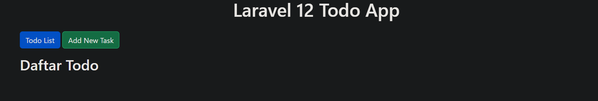

- Add Tugas Form

    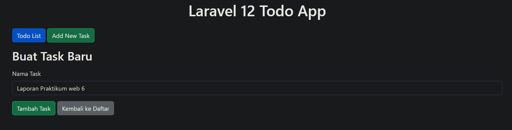

    Hasil

    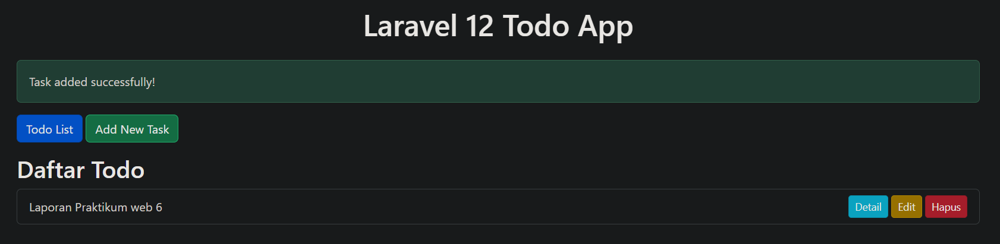

- Edit Tugas Form

    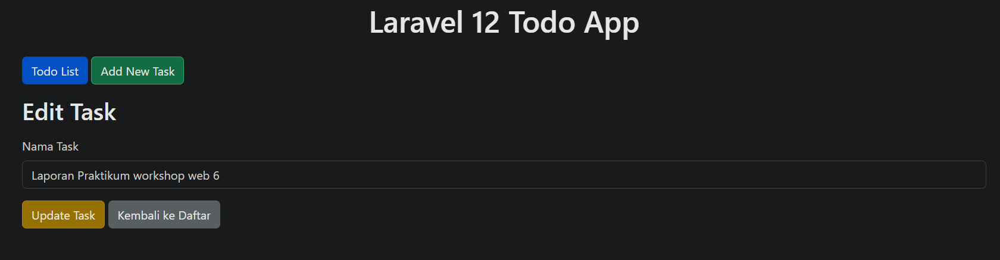

    Hasil

    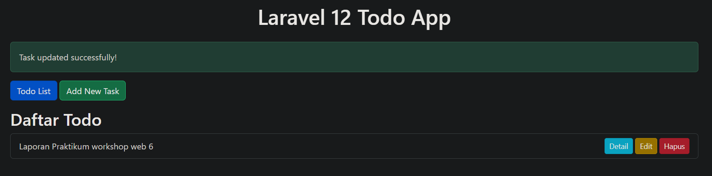

- Detail Tugas

    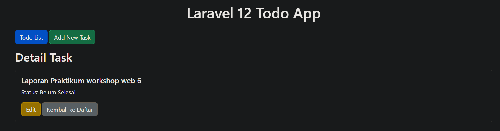

- Delete Tugas

    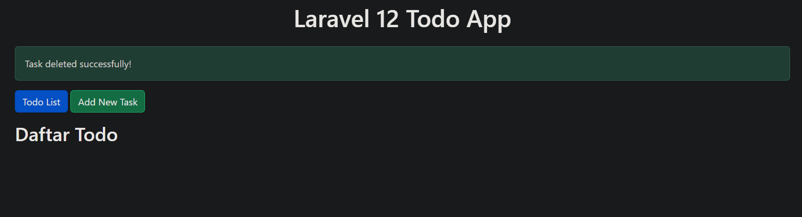

---

## 3. Hasil dan Pembahasan

Hasil dari tiga praktikum menunjukkan implementasi model di Laravel dalam berbagai skenario:

1. Model Binding Form menegaskan bahwa pemisahan logika data dari view meningkatkan struktur aplikasi.

2. DTO menunjukkan cara pengiriman data antar lapisan tanpa ketergantungan langsung terhadap request.

3. Eloquent ORM memberikan kemudahan dalam operasi CRUD database tanpa menulis query SQL secara manual.

Semua aplikasi berjalan sesuai harapan dan validasi input berfungsi dengan baik. Tampilan menggunakan Bootstrap juga meningkatkan pengalaman pengguna.

--- 

## 4. Kesimpulan

1. Laravel Model dan Eloquent ORM mempermudah pengelolaan data dengan pendekatan berorientasi objek.

2. DTO dan Repository Pattern membantu menjaga arsitektur aplikasi tetap bersih dan terorganisir.

3. Praktikum Todo CRUD menunjukkan implementasi penuh konsep MVC dan ORM yang efisien.

4. Dengan struktur ini, aplikasi menjadi mudah diuji, dikembangkan, dan dipelihara.

---

## 5. Referensi

- Laravel Documentation – Eloquent ORM - https://laravel.com/docs/12.x/eloquent

- Dicoding Blog – Apa Itu MVC? - https://www.dicoding.com/blog/apa-itu-mvc-pahami-konsepnya/

- Modul 6 – Model dan Laravel Eloquent – https://hackmd.io/@mohdrzu/ryIIM1a0ll